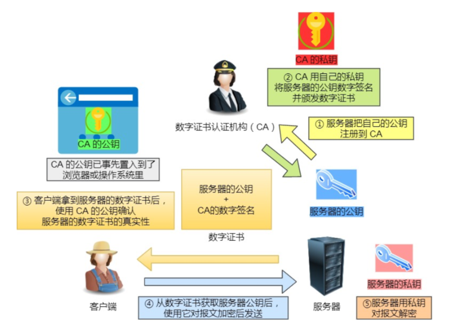
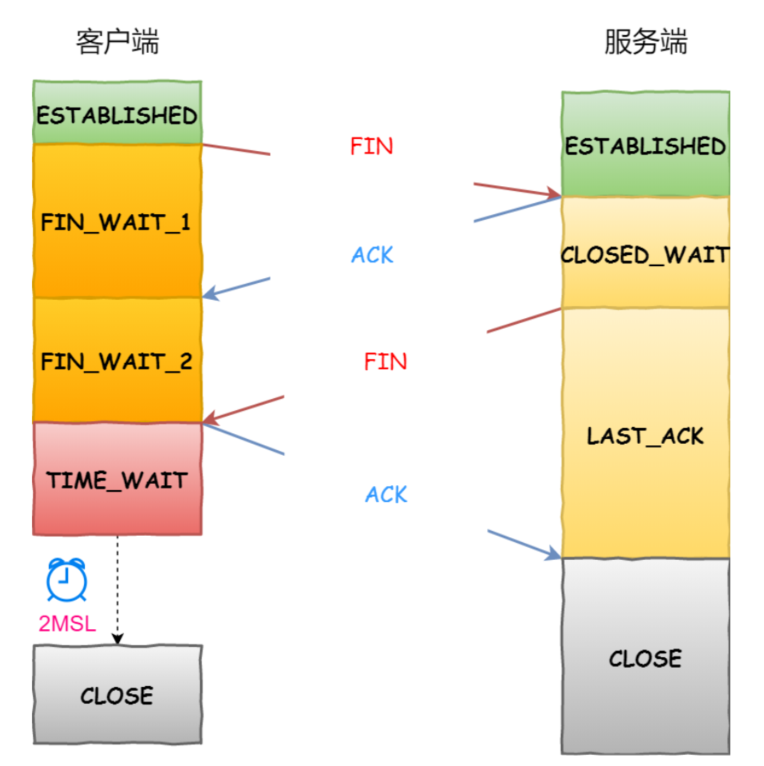
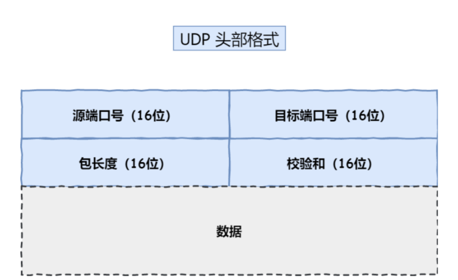

# 网络模型

## OSI 七层模型

## TCP/IP 网络模型

1. 应用层

2. 传输层

3. 网络层

4. 网络接口层

   

## 为什么要分层

各层之间相互独立，各层之间不需要关心其他层是如何实现的，只需要知道自己如何调用下层提供好的功能就可以了。类似我们开发时对系统进行分层。每一层专注一个功能，也对应我们高内聚、低耦合的原则

>  计算机科学领域的任何问题都可以通过增加一个间接的中间层来解决，计算机整个体系从上到下都是按照严格的层次结构设计的。

# HTTP

## HTTP请求报文

## HTTP响应报文

## HTTP特性

### 优点

- 简单
- 灵活（请求头key-value）
- 应用广泛、跨平台

### 缺点

- 无状态（cookie 解决）

- 明文传输、不安全（HTTPS，引入 SSL/TLS 层）

- 性能

  HTTP 协议是基于 TCP/IP，并且使⽤了「请求 - 应答」的通信模式，所以性能的关键就在这两点⾥。

  1. ⻓连接
     早期 HTTP/1.0 性能上的⼀个很⼤的问题，那就是每发起⼀个请求，都要新建⼀次 TCP 连接（三次握⼿），⽽且是
     串⾏请求，做了⽆谓的 TCP 连接建⽴和断开，增加了通信开销。
     为了解决上述 TCP 连接问题， HTTP/1.1 提出了⻓连接的通信⽅式，也叫持久连接。这种⽅式的好处在于减少了
     TCP 连接的重复建⽴和断开所造成的额外开销，减轻了服务器端的负载。
     持久连接的特点是，只要任意⼀端没有明确提出断开连接，则保持 TCP 连接状态。  

  2. 管道⽹络传输
     HTTP/1.1 采⽤了⻓连接的⽅式，这使得管道（pipeline）⽹络传输成为了可能。
     即可在同⼀个 TCP 连接⾥⾯，客户端可以发起多个请求，只要第⼀个请求发出去了，不必等其回来，就可以发第
     ⼆个请求出去，可以减少整体的响应时间。
     举例来说，客户端需要请求两个资源。以前的做法是，在同⼀个TCP连接⾥⾯，先发送 A 请求，然后等待服务器做
     出回应，收到后再发出 B 请求。管道机制则是允许浏览器同时发出 A 请求和 B 请求。
     但是**服务器**还是按照顺序，先回应 A 请求，完成后再回应 B 请求。要是前⾯的回应特别慢，后⾯就会有许多请求
     排队等着。这称为「队头堵塞」。  

     

     

## HTTP与HTTPS

### 区别

1. HTTP 是超⽂本传输协议，信息是明⽂传输，存在安全⻛险的问题。 HTTPS 则解决 HTTP 不安全的缺陷，在
   TCP 和 HTTP ⽹络层之间加⼊了 SSL/TLS 安全协议，使得报⽂能够加密传输。
2. HTTP 连接建⽴相对简单， TCP 三次握⼿之后便可进⾏ HTTP 的报⽂传输。⽽ HTTPS 在 TCP 三次握⼿之
   后，还需进⾏ SSL/TLS 的握⼿过程，才可进⼊加密报⽂传输。
3. HTTP 的端⼝号是 80， HTTPS 的端⼝号是 443。
4. HTTPS 协议需要向 CA（证书权威机构）申请数字证书，来保证服务器的身份是可信的 

### 工作原理

#### 基本流程
客户端向服务器索要并验证服务器的公钥。
双⽅协商⽣产「会话秘钥」。
双⽅采⽤「会话秘钥」进⾏加密通信。

#### 混合加密⽅式
HTTPS 采⽤的是对称加密和⾮对称加密结合的「混合加密」⽅式：  
- 在通信建⽴前采⽤⾮对称加密的⽅式交换「会话秘钥」，后续就不再使⽤⾮对称加密。
- 在通信过程中全部使⽤对称加密的「会话秘钥」的⽅式加密明⽂数据。

采⽤「混合加密」的⽅式的原因：
- 对称加密只使⽤⼀个密钥，运算速度快，密钥必须保密，⽆法做到安全的密钥交换。
- ⾮对称加密使⽤两个密钥：公钥和私钥，公钥可以任意分发⽽私钥保密，解决了密钥交换问题但速度慢。 

#### 数字证书
生成会话密钥前客户端要先向服务器端索要公钥，然后⽤公钥加密信息，服务器收到密⽂后，⽤⾃⼰的私钥解密。
**那么要如何保证公钥不被篡改和信任度？**
所以这⾥就需要借助第三⽅权威机构 CA （数字证书认证机构），将服务器公钥放在数字证书（由数字证书认证
机构颁发）中，只要证书是可信的，公钥就是可信的。  

#### SSL/TLS四次握手
1. ClientHello
    ⾸先，由客户端向服务器发起加密通信请求，也就是 ClientHello 请求。
    在这⼀步，客户端主要向服务器发送以下信息：
    （1）客户端⽀持的 SSL/TLS 协议版本，如 TLS 1.2 版本。
    （2）客户端⽣产的随机数（ Client Random ），后⾯⽤于⽣产「会话秘钥」。
    （3）客户端⽀持的密码套件列表，如 RSA 加密算法。
2. SeverHello
    服务器收到客户端请求后，向客户端发出响应，也就是 SeverHello 。服务器回应的内容有如下内容：
    （1）确认 SSL/ TLS 协议版本，如果浏览器不⽀持，则关闭加密通信。
    （2）服务器⽣产的随机数（ Server Random ），后⾯⽤于⽣产「会话秘钥」。
    （3）确认的密码套件列表，如 RSA 加密算法。
    （4）服务器的数字证书。
3. 客户端回应
    客户端收到服务器的回应之后，⾸先通过浏览器或者操作系统中的 CA 公钥，确认服务器的数字证书的真实性。
    如果证书没有问题，客户端会从数字证书中取出服务器的公钥，然后使⽤它加密报⽂，向服务器发送如下信息：
    （1）⼀个随机数（ pre-master key ）。该随机数会被服务器公钥加密。
    （2）加密通信算法改变通知，表示随后的信息都将⽤「会话秘钥」加密通信。
    （3）客户端握⼿结束通知，表示客户端的握⼿阶段已经结束。这⼀项同时把之前所有内容的发⽣的数据做个摘
    要，⽤来供服务端校验。上⾯第⼀项的随机数是整个握⼿阶段的第三个随机数，这样服务器和客户端就同时有三个随机数，接着就⽤双⽅协
    商的加密算法， 各⾃⽣成本次通信的「会话秘钥」。
4. 服务器的最后回应
    服务器收到客户端的第三个随机数（ pre-master key ）之后，通过协商的加密算法，计算出本次通信的「会话秘
    钥」。然后，向客户端发⽣最后的信息：
    （1）加密通信算法改变通知，表示随后的信息都将⽤「会话秘钥」加密通信。
    （2）服务器握⼿结束通知，表示服务器的握⼿阶段已经结束。这⼀项同时把之前所有内容的发⽣的数据做个摘
    要，⽤来供客户端校验。
    ⾄此，整个 SSL/TLS 的握⼿阶段全部结束。接下来，客户端与服务器进⼊加密通信，就完全是使⽤普通的 HTTP
    协议，只不过⽤「会话秘钥」加密内容。

## HTTP/1.1、HTTP/2、HTTP/3演变

### HTTP/1.1 相⽐ HTTP/1.0 性能上的改进：

- 使⽤ TCP ⻓连接的⽅式改善了 HTTP/1.0 短连接造成的性能开销。
- ⽀持管道（pipeline）⽹络传输，只要第⼀个请求发出去了，不必等其回来，就可以发第⼆个请求出去，可以
  减少整体的响应时间。

但 HTTP/1.1 还是有性能瓶颈：

- 请求 / 响应头部（Header）未经压缩就发送，⾸部信息越多延迟越⼤。只能压缩 Body 的部分；
- 发送冗⻓的⾸部。每次互相发送相同的⾸部造成的浪费较多；
- 服务器是按请求的顺序响应的，如果服务器响应慢，会招致客户端⼀直请求不到数据，也就是队头阻塞；
-  没有请求优先级控制；
- 请求只能从客户端开始，服务器只能被动响应。  

### HTTP/2 相⽐ HTTP/1.1 性能上的改进

1. 头部压缩
   HTTP/2 会压缩头（Header）如果你同时发出多个请求，他们的头是⼀样的或是相似的，那么，协议会帮你消除重
   复的部分。
   这就是所谓的 HPACK 算法：在客户端和服务器同时维护⼀张头信息表，所有字段都会存⼊这个表，⽣成⼀个索
   引号，以后就不发送同样字段了，只发送索引号，这样就提⾼速度了。
2. ⼆进制格式
   HTTP/2 不再像 HTTP/1.1 ⾥的纯⽂本形式的报⽂，⽽是全⾯采⽤了⼆进制格式，头信息和数据体都是⼆进制，并
   且统称为帧（frame）： 头信息帧和数据帧。  这样虽然对⼈不友好，但是对计算机⾮常友好，因为计算机只懂⼆进制，那么收到报⽂后，⽆需再将明⽂的报⽂转成⼆进制，⽽是直接解析⼆进制报⽂，这增加了数据传输的效率。  

3. 数据流
   HTTP/2 的数据包不是按顺序发送的，同⼀个连接⾥⾯连续的数据包，可能属于不同的回应。因此，必须要对数据
   包做标记，指出它属于哪个回应。
   每个请求或回应的所有数据包，称为⼀个数据流（ Stream ）。每个数据流都标记着⼀个独⼀⽆⼆的编号，其中规
   定客户端发出的数据流编号为奇数， 服务器发出的数据流编号为偶数
   客户端还可以指定数据流的优先级。优先级⾼的请求，服务器就先响应该请求。  

   

4. 多路复⽤
   HTTP/2 可以在⼀个连接中并发多个请求或回应，⽽不⽤按照顺序⼀⼀对应。
   移除了 HTTP/1.1 中的串⾏请求，不需要排队等待，也就不会再出现「队头阻塞」问题， 降低了延迟，⼤幅度提⾼
   了连接的利⽤率。
   举例来说，在⼀个 TCP 连接⾥，服务器收到了客户端 A 和 B 的两个请求，如果发现 A 处理过程⾮常耗时，于是就
   回应 A 请求已经处理好的部分，接着回应 B 请求，完成后，再回应 A 请求剩下的部分。 
5.  服务器推送
   HTTP/2 还在⼀定程度上改善了传统的「请求 - 应答」⼯作模式，服务不再是被动地响应，也可以主动向客户端发
   送消息。
   举例来说，在浏览器刚请求 HTML 的时候，就提前把可能会⽤到的 JS、 CSS ⽂件等静态资源主动发给客户端， 减
   少延时的等待，也就是服务器推送（Server Push，也叫 Cache Push）。  

### HTTP/2 有哪些缺陷？ HTTP/3 做了哪些优化？  

> HTTP/2 主要的问题在于，多个 HTTP 请求在复⽤⼀个 TCP 连接，下层的 TCP 协议是不知道有多少个 HTTP 请求
> 的。所以⼀旦发⽣了丢包现象，就会触发 TCP 的重传机制，这样在⼀个 TCP 连接中的所有的 HTTP 请求都必须等
> 待这个丢了的包被重传回来。
> HTTP/2 多个请求复⽤⼀个TCP连接，⼀旦发⽣丢包，就会阻塞住所有的 HTTP 请求。
> 这都是基于 TCP 传输层的问题，所以 HTTP/3 把 HTTP 下层的 TCP 协议改成了 UDP！  

HTTP/3 现在普及的进度⾮常的缓慢，不知道未来 UDP 是否能够逆袭 TCP。
HTTP/3 基于的QUIC 是⼀个在 UDP 之上的伪 TCP + TLS + HTTP/2 的多路复⽤的协议  

# TCP

## TCP头格式

- 序列号：在建⽴连接时由计算机⽣成的随机数作为其初始值，通过 SYN 包传给接收端主机，每发送⼀次数据，就
  「累加」⼀次该「数据字节数」的⼤⼩。 ⽤来解决⽹络包乱序问题。
- 确认应答号：指下⼀次「期望」收到的数据的序列号，发送端收到这个确认应答以后可以认为在这个序号以前的数
  据都已经被正常接收。 ⽤来解决不丢包的问题。
- 控制位：
  - ACK：该位为 1 时，「确认应答」的字段变为有效， TCP 规定除了最初建⽴连接时的 SYN 包之外该位必
    须设置为 1 。
  - RST：该位为 1 时，表示 TCP 连接中出现异常必须强制断开连接。
  - SYN：该位为 1 时，表示希望建⽴连接，并在其「序列号」的字段进⾏序列号初始值的设定。
  - FIN：该位为 1 时，表示今后不会再有数据发送，希望断开连接。当通信结束希望断开连接时，通信双⽅的
    主机之间就可以相互交换 FIN 位为 1 的 TCP 段。  

## 面向连接的、可靠的、基于字节流的传输层通信协议
- ⾯向连接：⼀定是「⼀对⼀」才能连接，不能像 UDP 协议可以⼀个主机同时向多个主机发送消息，也就是⼀
  对多是⽆法做到的；
- 可靠的：⽆论的⽹络链路中出现了怎样的链路变化， TCP 都可以保证⼀个报⽂⼀定能够到达接收端；
- 字节流：消息是「没有边界」的，所以⽆论我们消息有多⼤都可以进⾏传输。并且消息是「有序的」，当
  「前⼀个」消息没有收到的时候，即使它先收到了后⾯的字节，那么也不能扔给应⽤层去处理，同时对「重
  复」的报⽂会⾃动丢弃。  

## 四元组

- 源地址
- 源端口
- 目的地址
- 目的端口

源地址和⽬的地址的字段（32位）是在**IP 头部**中，作⽤是通过 IP 协议发送报⽂给对⽅主机。
源端⼝和⽬的端⼝的字段（16位）是在 TCP 头部中，作⽤是告诉 TCP 协议应该把报⽂发给哪个进程  

## 有⼀个 IP 的服务器监听了⼀个端⼝，它的 TCP 的最⼤连接数是多少？  

服务器通常固定在某个本地端⼝上监听，等待客户端的连接请求。
因此，客户端 IP 和 端⼝是可变的，其理论值计算公式如下:

对 IPv4，客户端的 IP 数最多为 2 的 32 次⽅，客户端的端⼝数最多为 2 的 16 次⽅，也就是服务端单机最
⼤ TCP 连接数，约为 2 的 48 次⽅。

**当然，服务端最⼤并发 TCP 连接数远不能达到理论上限**

- ⾸先主要是⽂件描述符限制， Socket 都是⽂件，所以⾸先要通过 ulimit 配置⽂件描述符的数⽬；

- 另⼀个是内存限制，每个 TCP 连接都要占⽤⼀定内存，操作系统的内存是有限的。  

## TCP三次握手

### 为什么是三次握手

> 片面地说：因为三次握⼿才能保证双⽅具有接收和发送的能⼒。  

## MTU和MSS

#### 概念

- MTU：物理接口（数据链路层）提供给其上层最大一次传输数据的大小，比如IP层，假定其上层协议是IP，缺省MTU=1500，意思是：整个IP包最大从这个接口发送出去的是1500个字节。可以通过配置修改成更大或更小的值，只要在系统的边界值以内即可，但是切记要在链路的两端都要修改，而且要大小一样，如果不一样，会造成大侧的数据被小侧丢弃。

- MSS：TCP提交给IP层最大分段大小，不包含TCP Header和 TCP Option，只包含TCP Payload。

- MSS = MTU - IP Header - TCP Header

#### 既然 IP 层会分⽚，为什么 TCP 层还需要 MSS ？

> 因为IP 层本身没有超时重传机制，它由传输层的 TCP 来负责超时和重传。

当 IP 层有⼀个超过 MTU ⼤⼩的数据（TCP 头部 + TCP 数据）要发送，那么 IP 层就要进⾏分⽚，把数据分⽚成
若⼲⽚，保证每⼀个分⽚都⼩于 MTU。把⼀份 IP 数据报进⾏分⽚以后，由⽬标主机的 IP 层来进⾏重新组装后，
再交给上⼀层 TCP 传输层。  
这就导致了如果⼀个 IP 分⽚丢失，整个 IP 报⽂的所有分⽚都得重传。  

当接收⽅发现 TCP 报⽂（头部 + 数据）的某⼀⽚丢失后，则不会响应 ACK 给对⽅，那么发送⽅的 TCP 在超时
后，就会重发「整个 TCP 报⽂（头部 + 数据）」。
因此，可以得知由 IP 层进⾏分⽚传输，是⾮常没有效率的。
所以，为了达到最佳的传输效能 TCP 协议在建⽴连接的时候通常要协商双⽅的 MSS 值，当 TCP 层发现数据超过
MSS 时，则就先会进⾏分⽚，当然由它形成的 IP 包的⻓度也就不会⼤于 MTU ，⾃然也就不⽤ IP 分⽚了。  

## TCP四次挥手

**主动关闭连接的，才有 TIME_WAIT 状态**

### 为什么是四次挥手

**TCP 是可以双向传输数据的，也就是[全双工协议](https://www.zhihu.com/search?q=全双工协议&search_source=Entity&hybrid_search_source=Entity&hybrid_search_extra={"sourceType"%3A"answer"%2C"sourceId"%3A2306127873})。**

- 关闭连接时，客户端向服务端发送 FIN 时，仅仅表示客户端不再发送数据了但是还能接收数据。
- 服务器收到客户端的 FIN 报⽂时，先回⼀个 ACK 应答报⽂，⽽服务端可能还有数据需要处理和发送
- 等服务端不再发送数据时，才发送 FIN 报⽂给客户端来表示同意现在关闭连接。

从上⾯过程可知，服务端通常需要等待完成数据的发送和处理，所以服务端的 ACK 和 FIN ⼀般都会分开发送，从⽽⽐三次握⼿导致多了⼀次。

### 为什么 TIME_WAIT 等待的时间是 2MSL

- ⽹络中可能存在来⾃发送⽅的数据包，当这些发送⽅的数据包被接收⽅处理后⼜会向对⽅发送响应，所以⼀来⼀回需要等待 2 倍的时间。
- 例如如果被动关闭⽅没有收到断开连接的最后的 ACK 报⽂，就会触发超时重发 Fin 报⽂，主动关闭⽅接收到 FIN 后，
  会重发 ACK 给被动关闭⽅， ⼀来⼀去正好需要 2 个 MSL。    
- 经过 2MSL 这个时间， ⾜以让两个⽅向上的数据包都被丢弃，使得原来连接的数据包在⽹络中都⾃然消失，再出现的数据包⼀定都是新建⽴连接所产⽣的。  

> 在 Linux 系统⾥ 2MSL 默认是 60 秒，那么⼀个 MSL 也就是 30 秒。 Linux 系统停留在 TIME_WAIT 的时
> 间为固定的 60 秒。  

### TIME_WAIT 过多的危害
如果服务器有处于 TIME-WAIT 状态的 TCP，则说明是由服务器⽅主动发起的断开请求。
过多的 TIME-WAIT 状态主要的危害有两种：
- 内存资源占⽤；
- 如果是发起连接方（客户端）有过多 TIME_WAIT，还会有对端⼝资源的占⽤，⼀个 TCP 连接⾄少消耗⼀个本地端⼝；

服务端受系统资源限制：
由于⼀个四元组表示 TCP 连接，理论上服务端可以建⽴很多连接，服务端确实只监听⼀个端⼝ 但是会把连接
扔给处理线程，所以理论上监听的端⼝可以继续监听。但是线程池处理不了那么多⼀直不断的连接了。所以
当服务端出现⼤量 TIME_WAIT 时，系统资源被占满时，会导致处理不过来新的连接

客户端受端⼝资源限制：
如果是客户端TIME_WAIT过多，就会导致端⼝资源被占⽤，因为端⼝就65536个，被占满就会导致⽆法创建新的连
接。

### 如何优化 TIME_WAIT 过多

TODO 还没弄清楚

> 修改内核参数
>
> - net.ipv4.tcp_tw_reuse 和 tcp_timestamps （ 应该只适用于客户端/连接发起端）

## 滑动窗口

### 背景

TCP 每发送⼀个数据，都要进⾏⼀次确认应答。

当上⼀个数据包收到了应答了， 再发送下⼀个，这种⽅式的缺点是效率⽐较低的。

这样的传输⽅式有⼀个缺点：数据包的往返时间越⻓，通信的效率就越低。
为解决这个问题， TCP 引⼊了窗⼝这个概念。即使在往返时间较⻓的情况下，它也不会降低⽹络通信的效率。
**窗⼝⼤⼩就是指⽆需等待确认应答，⽽可以继续发送数据的最⼤值。**
窗⼝的实现实际上是操作系统开辟的⼀个缓存空间，发送⽅主机在等到确认应答返回之前，必须在缓冲区中保留已
发送的数据。如果按期收到确认应答，此时数据就可以从缓存区清除。  

图中的 ACK 600 确认应答报⽂丢失，也没关系，因为可以通过下⼀个确认应答进⾏确认，只要发送⽅收到了 ACK
700 确认应答，就意味着 700 之前的所有数据「接收⽅」都收到了。这个模式就叫累计确认或者累计应答。  

### 窗口大小的确定

TCP 头⾥有⼀个字段叫 Window ，也就是窗⼝⼤⼩。
这个字段是**接收端告诉发送端自己还有多少缓冲区可以接收数据**。于是发送端就可以根据这个接收端的处理能⼒来
发送数据，⽽不会导致接收端处理不过来。
所以，通常窗⼝的⼤⼩是由接收⽅的窗⼝⼤⼩来决定的。  

### 发送方的滑动窗口

### 接收方的滑动窗口

## 流量控制

- 流量控制：TCP 提供⼀种机制可以让「发送⽅」根据「接收⽅」的实际接收能⼒控制发送的数据量。

- TCP 通过让接收⽅指明希望从发送⽅接收的数据⼤⼩（窗⼝⼤⼩）来进⾏流量控制。  

  

# UDP

UDP 不提供复杂的控制机制，利⽤ IP 提供⾯向「⽆连接」的通信服务。并且头部只有 8 个字节（ 64 位）：  

# TCP和UDP

## 对比

1. 连接
   TCP 是⾯向连接的传输层协议，传输数据前先要建⽴连接。
   UDP 是不需要连接，即刻传输数据。
2.  服务对象
   TCP 是⼀对⼀的两点服务，即⼀条连接只有两个端点。
   UDP ⽀持⼀对⼀、⼀对多、多对多的交互通信
3. 可靠性
   TCP 是可靠交付数据的，数据可以⽆差错、不丢失、不重复、按需到达。
   UDP 是尽最⼤努⼒交付，不保证可靠交付数据。
4. 拥塞控制、流量控制
   TCP 有拥塞控制和流量控制机制，保证数据传输的安全性。
   UDP 则没有，即使⽹络⾮常拥堵了，也不会影响 UDP 的发送速率。
5. ⾸部开销
   TCP ⾸部⻓度较⻓，会有⼀定的开销，⾸部在没有使⽤「选项」字段时是 20 个字节，如果使⽤了「选项」
   字段则会变⻓的。
   UDP ⾸部只有 8 个字节，并且是固定不变的，开销较⼩。
6. 传输⽅式
   TCP 是流式传输，没有边界，但保证顺序和可靠。
   UDP 是⼀个包⼀个包的发送，是有边界的，但可能会丢包和乱序。
7. 分⽚不同
   TCP 的数据⼤⼩如果⼤于 MSS ⼤⼩，则会在传输层进⾏分⽚，⽬标主机收到后，也同样在传输层组装 TCP
   数据包，如果中途丢失了⼀个分⽚，只需要传输丢失的这个分⽚。
   UDP 的数据⼤⼩如果⼤于 MTU ⼤⼩，则会在 IP 层进⾏分⽚，⽬标主机收到后，在 IP 层组装完数据，接着
   再传给传输层，但是如果中途丢了⼀个分⽚，在实现可靠传输的 UDP 时则就需要重传所有的数据包，这样
   传输效率⾮常差，所以通常 UDP 的报⽂应该⼩于 MTU。
8. 应⽤场景：
   由于 TCP 是⾯向连接，能保证数据的可靠性交付，因此经常⽤于：
   
   - FTP ⽂件传输
   - HTTP / HTTPS
   
   由于 UDP ⾯向⽆连接，它可以随时发送数据，再加上UDP本身的处理既简单⼜⾼效，因此经常⽤于：
   - 包总量较少的通信，如 DNS 、 SNMP 等
   - 视频、⾳频等多媒体通信
   - ⼴播通信  

## 为什么 UDP 头部没有「⾸部⻓度」字段，⽽ TCP 头部有「⾸部⻓度」字段

TCP 有可变⻓的「选项」字段，⽽ UDP 头部⻓度则是不会变化的，⽆需多⼀个字段去记录 UDP 的⾸部⻓
度。  

## 为什么 UDP 头部有「包⻓度」字段，⽽ TCP 头部则没有「包⻓度」字段

其中 IP 总⻓度 和 IP ⾸部⻓度，在 IP ⾸部格式是已知的。 TCP ⾸部⻓度，则是在 TCP ⾸部格式已知的，所以就
可以求得 TCP 数据的⻓度。
所以问题就变成了 “ UDP 也是基于 IP 层的呀，为什么 UDP 还要有包长度字段 ”

> 有可能是因为
> 为了补全UDP ⾸部⻓度是 4 字节的整数倍，补充了「包⻓度」字段。  

# 在浏览器中输入 url 地址到显示主页的过程

总体来说分为以下几个过程:

1. DNS 解析

2. TCP 连接

3. 发送 HTTP 请求

4. 服务器处理请求并返回 HTTP 报文

5. 浏览器解析渲染页面

6. 连接结束

# Linux网络包接收过程

.png)

> 软中断是怎么处理⽹络包的呢？它会从 Ring Buffer 中拷⻉数据到内核 struct sk_buff 缓冲区中，从⽽可以作为⼀
> 个⽹络包交给⽹络协议栈进⾏逐层处理。
> ⾸先，会先进⼊到⽹络接⼝层，在这⼀层会检查报⽂的合法性，如果不合法则丢弃，合法则会找出该⽹络包的上层
> 协议的类型，⽐如是 IPv4，还是 IPv6，接着再去掉帧头和帧尾，然后交给⽹络层。
> 到了⽹络层，则取出 IP 包，判断⽹络包下⼀步的⾛向，⽐如是交给上层处理还是转发出去。当确认这个⽹络包要
> 发送给本机后，就会从 IP 头⾥看看上⼀层协议的类型是 TCP 还是 UDP，接着去掉 IP 头，然后交给传输层。
> 传输层取出 TCP 头或 UDP 头，根据四元组「源 IP、源端⼝、⽬的 IP、⽬的端⼝」 作为标识，找出对应的
> Socket，并把数据拷⻉到 Socket 的接收缓冲区。
> 最后，应⽤层程序调⽤ Socket 接⼝，从内核的 Socket 接收缓冲区读取新到来的数据到应⽤层  

# linux网络包发送过程

.png)

- ⾸先，应⽤程序会调⽤ Socket 发送数据包的接⼝，由于这个是系统调⽤，所以会从⽤户态陷⼊到内核态中的
  Socket 层， Socket 层会将应⽤层数据拷⻉到 Socket 发送缓冲区中。
- 接下来，⽹络协议栈从 Socket 发送缓冲区中取出数据包，并按照 TCP/IP 协议栈从上到下逐层处理。
- 如果使⽤的是 TCP 传输协议发送数据，那么会在传输层增加 TCP 包头，然后交给⽹络层，⽹络层会给数据包增加
  IP 包，然后通过查询路由表确认下⼀跳的 IP，并按照 MTU ⼤⼩进⾏分⽚。
- 分⽚后的⽹络包，就会被送到⽹络接⼝层，在这⾥会通过 ARP 协议获得下⼀跳的 MAC 地址，然后增加帧头和帧
  尾，放到发包队列中。
- 这⼀些准备好后，会触发软中断告诉⽹卡驱动程序，这⾥有新的⽹络包需要发送，最后驱动程序通过 DMA，从发
  包队列中读取⽹络包，将其放⼊到硬件⽹卡的队列中，随后物理⽹卡再将它发送出去。  
