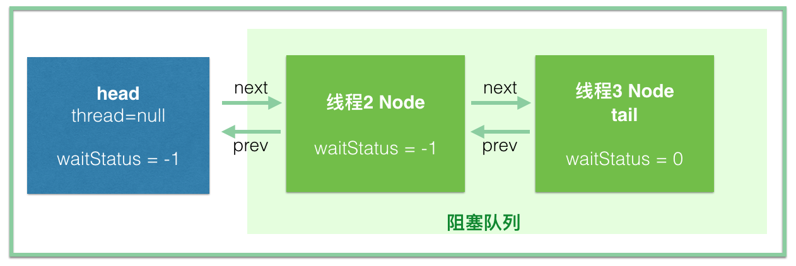

# 自旋锁、排队自旋锁、MCS锁、CLH锁

[自旋锁、排队自旋锁、MCS锁、CLH锁](https://coderbee.net/index.php/concurrent/20131115/577)

# aqs

## [一行一行源码分析清楚AbstractQueuedSynchronizer](https://javadoop.com/post/AbstractQueuedSynchronizer)

```java
// 头结点，你直接把它当做当前持有锁的线程 可能是最好理解的. (unparkSuccessor不把head视为需要唤醒的节点)
private transient volatile Node head;

// 阻塞的尾节点，每个新的节点进来，都插入到最后，也就形成了一个链表
private transient volatile Node tail;

// 这个是最重要的，代表当前锁的状态，0代表没有被占用，大于 0 代表有线程持有当前锁
// 这个值可以大于 1，是因为锁可以重入，每次重入都加上 1
private volatile int state;

// 代表当前持有独占锁的线程，举个最重要的使用例子，因为锁可以重入
// reentrantLock.lock()可以嵌套调用多次，所以每次用这个来判断当前线程是否已经拥有了锁
// if (currentThread == getExclusiveOwnerThread()) {state++}
private transient Thread exclusiveOwnerThread; //继承自AbstractOwnableSynchronizer
```

`waitStatus 中 SIGNAL(-1) 状态的意思，Doug Lea 注释的是：代表后继节点需要被唤醒。也就是说这个 waitStatus 其实代表的不是自己的状态，而是后继节点的状态，我们知道，每个 node 在入队的时候，都会把前驱节点的状态改为 SIGNAL，然后阻塞，等待被前驱唤醒。`



## [condition和Interrupted ](https://www.javadoop.com/post/AbstractQueuedSynchronizer-2)

## [CountDownLatch、CyclicBarrier、Semaphore ](https://www.javadoop.com/post/AbstractQueuedSynchronizer-3)