# InnoDB和MyISAM的区别

> MySQL 5.5 之前，MyISAM 引擎是 MySQL 的默认存储引擎，5.5 版本后默认的存储引擎为 InnoDB

- InnoDB支持行级锁和表级锁，默认为行级锁。MyISAM只支持表级锁

- InnoDB支持事务，MyISAM不支持

- InnoDB支持外键，MyISAM不支持

- InnoDB 通过`redo log`支持数据库异常崩溃后的安全恢复，MyISAM不支持

# InnoDB是如何存储数据的

记录是按照行来存储的，但是数据库的读取并不以「行」为单位，否则一次读取（也就是一次 I/O 操作）只能处理一行数据，效率会非常低。

因此，**InnoDB 的数据是按「数据页」为单位来读写的**，也就是说，当需要读一条记录的时候，并不是将这个记录本身从磁盘读出来，而是以页为单位，将其整体读入内存。

数据库的 I/O 操作的最小单位是页，**InnoDB 数据页的默认大小是 16KB**，意味着数据库每次读写都是以 16KB 为单位的，一次最少从磁盘中读取 16K 的内容到内存中，一次最少把内存中的 16K 内容刷新到磁盘中。

数据页包括七个部分，结构如下图：

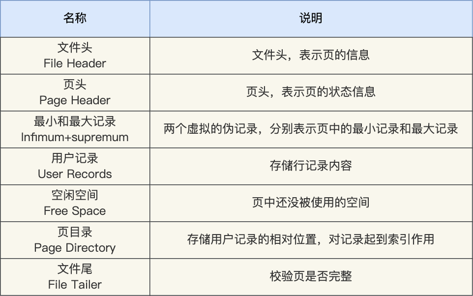

在 File Header 中有两个指针，分别指向上一个数据页和下一个数据页，连接起来的页相当于一个双向的链表，如下图所示：

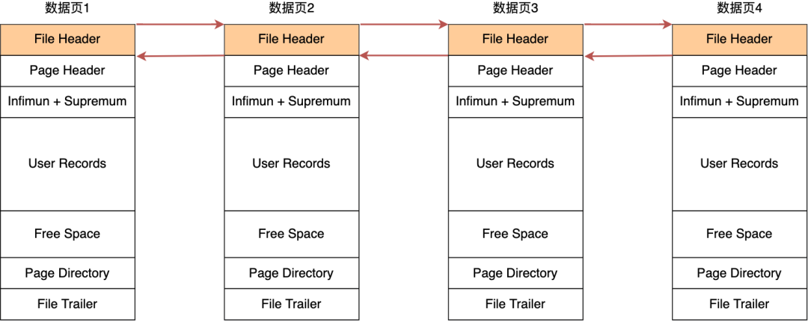

数据页的主要作用是存储记录，也就是数据库的数据，所以重点说一下数据页中的 User Records 是怎么组织数据的。

**数据页中的记录按照「主键」顺序组成单向链表**，单向链表的特点就是插入、删除非常方便，但是检索效率不高，最差的情况下需要遍历链表上的所有节点才能完成检索。

因此，数据页中有一个**页目录**，起到记录的索引作用，就像我们书那样，针对书中内容的每个章节设立了一个目录，想看某个章节的时候，可以查看目录，快速找到对应的章节的页数，而数据页中的页目录就是为了能快速找到记录。

那 InnoDB 是如何给记录创建页目录的呢？页目录与记录的关系如下图：

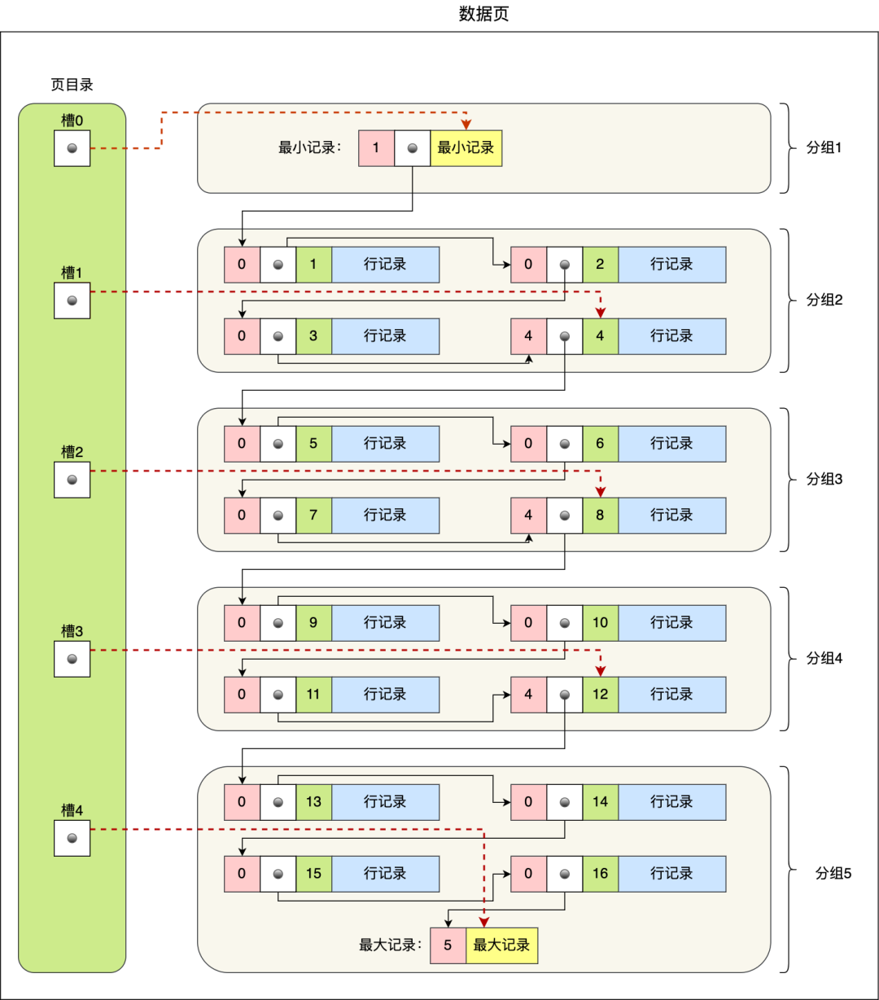

从图可以看到，**页目录就是由多个槽组成的，槽相当于分组记录的索引**。然后，因为记录是按照「主键值」从小到大排序的，所以**我们通过槽查找记录时，可以使用二分法快速定位要查询的记录在哪个槽（哪个记录分组），定位到槽后，再遍历槽内的所有记录，找到对应的记录**。

InnoDB 里的 B+ 树中的**每个节点都是一个数据页**，结构示意图如下：

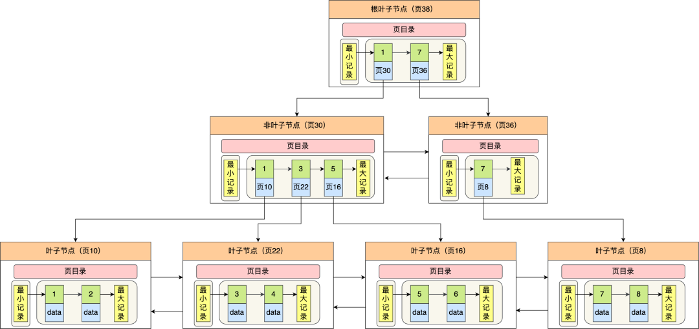

>我们再看看 B+ 树如何实现快速查找主键为 6 的记录，以上图为例子：
>- 从根节点开始，通过二分法快速定位到符合页内范围包含查询值的页，因为查询的主键值为 6，在[1, 7)范围之间，所以到页 30 中查找更详细的目录项；
>
>- 在非叶子节点（页30）中，继续通过二分法快速定位到符合页内范围包含查询值的页，主键值大于 5，所以就到叶子节点（页16）查找记录；
>
>- 接着，在叶子节点（页16）中，通过槽查找记录时，使用二分法快速定位要查询的记录在哪个槽（哪个记录分组），定位到槽后，再遍历槽内的所有记录，找到主键为 6 的记录。

可以看到，在定位记录所在哪一个页时，也是通过二分法快速定位到包含该记录的页。定位到该页后，又会在该页内进行二分法快速定位记录所在的分组（槽号），最后在分组内进行遍历查找。

# 索引

## 聚簇索引和非聚簇索引

索引又可以分成聚簇索引和非聚簇索引（二级索引），它们区别就在于叶子节点存放的是什么数据：
- 聚簇索引的叶子节点存放的是实际数据，所有完整的用户记录都存放在聚簇索引的叶子节点；
- 二级索引的叶子节点存放的是主键值，而不是实际数据。

因为表的数据都是存放在聚簇索引的叶子节点里，所以 **InnoDB 存储引擎一定会为表创建一个聚簇索引，且由于数据在物理上只会保存一份，所以聚簇索引只能有一个**
InnoDB 在创建聚簇索引时，会根据不同的场景选择不同的列作为索引：
- 如果有主键，默认会使用主键作为聚簇索引的索引键；
- 如果没有主键，就选择第一个不包含 NULL 值的唯一列作为聚簇索引的索引键；
- 在上面两个都没有的情况下，InnoDB 将自动生成一个隐式自增 id 列作为聚簇索引的索引键；

一张表只能有一个聚簇索引，那为了实现非主键字段的快速搜索，就引出了二级索引（非聚簇索引/辅助索引），它也是利用了 B+ 树的数据结构，二级索引的叶子节点存放的是主键值，不是实际数据。

> 因此，**如果某个查询语句使用了二级索引，但是查询的数据不是主键值，这时在二级索引找到主键值后，需要去聚簇索引中获得数据行，这个过程就叫作「回表」，也就是说要查两个 B+ 树才能查到数据。不过，当查询的数据是主键值时，因为只在二级索引就能查询到，不用再去聚簇索引查，这个过程就叫作「索引覆盖」，也就是只需要查一个 B+ 树就能找到数据。**

## 为什么不适用哈希表作为索引的数据结构

1.Hash 冲突问题

2.Hash 索引不支持顺序和范围查询(Hash 索引不支持顺序和范围查询是它最大的缺点

## 注意事项

> [索引失效](https://xiaolincoding.com/mysql/index/index_lose.html)

**1.选择合适的字段创建索引：**

- **不为 NULL 的字段** ：索引字段的数据应该尽量不为 NULL，因为对于数据为 NULL 的字段，数据库较难优化。如果字段频繁被查询，但又避免不了为 NULL，建议使用 0,1,true,false 这样语义较为清晰的短值或短字符作为替代。
- **被频繁查询的字段** ：我们创建索引的字段应该是查询操作非常频繁的字段。
- **被作为条件查询的字段** ：被作为 WHERE 条件查询的字段，应该被考虑建立索引。
- **频繁需要排序的字段** ：索引已经排序，这样查询可以利用索引的排序，加快排序查询时间。
- **被经常频繁用于连接的字段** ：经常用于连接的字段可能是一些外键列，对于外键列并不一定要建立外键，只是说该列涉及到表与表的关系。对于频繁被连接查询的字段，可以考虑建立索引，提高多表连接查询的效率。

**2.被频繁更新的字段应该慎重建立索引。**

虽然索引能带来查询上的效率，但是维护索引的成本也是不小的。 如果一个字段不被经常查询，反而被经常修改，那么就更不应该在这种字段上建立索引了。

**3.注意避免冗余索引** 。

冗余索引指的是索引的功能相同，能够命中索引(a, b)就肯定能命中索引(a) ，那么索引(a)就是冗余索引。如（name,city ）和（name ）这两个索引就是冗余索引，能够命中前者的查询肯定是能够命中后者的。在大多数情况下，都应该尽量扩展已有的索引而不是创建新索引。

**4.尽可能的考虑建立联合索引而不是单列索引。**

因为索引是需要占用磁盘空间的，可以简单理解为每个索引都对应着一颗 B+树。如果一个表的字段过多，索引过多，那么当这个表的数据达到一个体量后，索引占用的空间也是很多的，且修改索引时，耗费的时间也是较多的。如果是联合索引，多个字段在一个索引上，那么将会节约很大磁盘空间，且修改数据的操作效率也会提升。

**5.考虑在字符串类型的字段上使用前缀索引代替普通索引。**

前缀索引仅限于字符串类型，较普通索引会占用更小的空间，所以可以考虑使用前缀索引带替普通索引。

**6.避免 where 子句中对字段施加函数，这会造成无法命中索引。**

**7.在使用 InnoDB 时使用与业务无关的自增主键作为主键，即使用逻辑主键，而不要使用业务主键。**

**8.删除长期未使用的索引，不用的索引的存在会造成不必要的性能损耗 MySQL 5.7 可以通过查询 sys 库的 schema_unused_indexes 视图来查询哪些索引从未被使用**

**9.隐式转换会导致索引失效如: select name from customer where id = '111';**

**10.当我们使用左或者左右模糊匹配的时候，也就是 `like %xx` 或者 `like %xx%`这两种方式都会造成索引失效；**

**11.MySQL 在遇到字符串和数字比较的时候，会自动把字符串转为数字，然后再进行比较。如果字符串是索引列，而条件语句中的输入参数是数字的话，那么索引列会发生隐式类型转换，由于隐式类型转换是通过 CAST 函数实现的，等同于对索引列使用了函数，所以就会导致索引失效。**

**12. 数据库在取出索引的同时，会根据 where 条件直接过滤掉不满足条件的记录，减少回表次数。这就是 索引下推 (Index Condition Pushdown,ICP) ，一种根据索引进行查询的优化方式，即索引下推是数据库检索数据过程中为减少回表次数而做的优化**

# 事务
## ACID特性

1. **原子性**（`Atomicity`） ： 事务是最小的执行单位，不允许分割。事务的原子性确保动作要么全部完成，要么完全不起作用；
2. **一致性**（`Consistency`）： 数据库的完整性不会因为事务的执行而受到破坏，比如表中有一个字段为姓名，它有唯一约束，也就是表中姓名不能重复，如果一个事务对姓名字段进行了修改，但是在事务提交后，表中的姓名变得非唯一性了，这就破坏了事务的一致性要求，这时数据库就要撤销该事务，返回初始化的状态。
3. **隔离性**（`Isolation`）： 数据库允许多个并发事务同时对其数据进行读写和修改的能力，隔离性可以防止多个事务并发执行时由于交叉执行而导致数据的不一致。
4. **持久性**（`Durability`）： 一个事务被提交之后。它对数据库中数据的改变是持久的，即使数据库发生故障也不应该对其有任何影响。

> - 持久性是通过 redo log （重做日志）来保证的；
>- 原子性是通过 undo log（回滚日志） 来保证的；
> - 隔离性是通过 MVCC（多版本并发控制） 或锁机制来保证的；
>- 一致性则是通过持久性+原子性+隔离性来保证；

## 并发事务引发的问题

- **脏读（Dirty read）:** 事务T1修改了一行数据，事务T2在事务T1提交之前读到了该行数据。因为这个数据是还没有提交的数据，那么另外一个事务读到的这个数据是“脏数据”，依据“脏数据”所做的操作可能是不正确的。

- **丢失修改（Lost to modify）:** 指在一个事务读取一个数据时，另外一个事务也访问了该数据，那么在第一个事务中修改了这个数据后，第二个事务也修改了这个数据。这样第一个事务内的修改结果就被丢失，因此称为丢失修改。 例如：事务 1 读取某表中的数据 A=20，事务 2 也读取 A=20，事务 1 修改 A=A-1，事务 2 也修改 A=A-1，最终结果 A=19，事务 1 的修改被丢失。

- **不可重复读（Unrepeatable read）:** 指在一个事务内多次读同一数据。在这个事务还没有结束时，另一个事务也访问该数据。那么，在第一个事务中的两次读数据之间，由于第二个事务的修改导致第一个事务两次读取的数据可能不太一样。这就发生了在一个事务内两次读到的数据是不一样的情况，因此称为不可重复读。

- **幻读（Phantom read）:** 事务T1读取了满足某条件的一个数据集，事务T2插入了一行或者多行数据满足了T1的选择条件，导致事务T1再次使用同样的选择条件读取的时候，得到了比第一次读取更多的数据集。

## 事务隔离级别

- **READ-UNCOMMITTED(读取未提交)：** 所有事务都可以看到其他未提交事务的执行结果，可能会导致脏读、幻读或不可重复读。

- **READ-COMMITTED(读取已提交)：** 事务只能看见已经提交事务所做的改变。可以阻止脏读，但是幻读或不可重复读仍有可能发生。

- **REPEATABLE-READ(可重复读)：** 对同一字段的多次读取结果都是一致的，**除非数据是被本身事务自己所修改**，可以阻止脏读和不可重复读，但幻读仍有可能发生。（ InnoDB 默认使用隔离级别）

- **SERIALIZABLE(可串行化)：** 最高的隔离级别，它通过强制事务排序依次逐个执行，使之不可能相互冲突，从而解决幻读问题。简言之，它是在每个读的数据行上加上共享锁。在这个级别，可能导致大量的超时现象和锁竞争。该级别可以防止脏读、不可重复读以及幻读。（ 分布式事务 的情况下会用到该隔离级别。）

## 快照读

对于`快照读/一致性非锁定读（Consistent Nonlocking Reads）` 的实现，通常做法是加一个版本号或者时间戳字段，在更新数据的同时版本号 + 1 或者更新时间戳。查询时，将当前可见的版本号与对应记录的版本号进行比对，如果记录的版本小于可见版本，则表示该记录可见

在 InnoDB 存储引擎中，`MVCC/多版本并发控制 (multi versioning Concurrency Control) `就是对`快照读/非锁定读`的实现。

在 Repeatable Read 和 Read Committed 两个隔离级别下，如果是执行普通的 select 语句（不包括 select ... lock in share mode ,select ... for update）使用的就是`一致性非锁定读（MVCC）`。

### InnoDB对MVCC的实现

> `MVCC` 的实现依赖于：**隐藏字段、Read View、undo log**。在内部实现中，`InnoDB` 通过数据行的 `DB_TRX_ID` 和 `Read View` 来判断数据的可见性，如不可见，则通过数据行的 `DB_ROLL_PTR` 找到 `undo log` 中的历史版本继续判断。每个事务读到的数据版本可能是不一样的，在同一个事务中，**用户只能看到该事务创建 `Read View` 之前已经提交的修改和该事务本身做的修改**
> 隐藏字段

**Read View包含字段:**
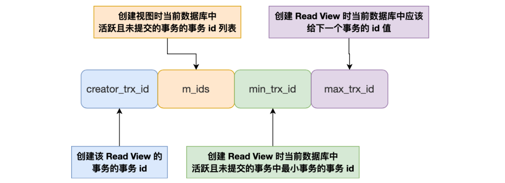

而InnoDB 存储引擎也为每行数据添加了三个 隐藏字段：

- DB_TRX_ID（6字节）：表示最后一次改动该行的事务 id。

- DB_ROLL_PTR（7字节）:  当前行的回滚指针，指向该行的 undo log 。该行记录上所有旧版本在 undolog 中都通过链表的形式组织。

- DB_ROW_ID（6字节）：如果没有设置主键且该表没有唯一非空索引时，InnoDB 会使用该 id 来生成聚簇索引`（MySQL的B+树索引特性要求每个表必须要有一个主键。如果没有设置的话，会自动寻找第一个不包含NULL的唯一索引列作为主键。如果还是找不到，就会在这个DB_ROW_ID上自动生成一个唯一值，以此来当作主键）`

所以在创建 Read View 后，我们可以将记录中的 trx_id 划分这三种情况从而做出可见性判断：

- 如果记录的 trx_id 值小于 Read View 中的 min_trx_id 值，表示这个版本的记录是在创建 Read View 前已经提交的事务生成的，所以该版本的记录对当前事务可见。

- 如果记录的 trx_id 值大于等于 Read View 中的 max_trx_id 值，表示这个版本的记录是在创建 Read View 后才启动的事务生成的，所以该版本的记录对当前事务不可见。

- 如果记录的 trx_id 值在 Read View 的 min_trx_id 和 max_trx_id 之间，需要判断 trx_id 是否在 m_ids 列表中：

  - 如果记录的 trx_id 在 m_ids 列表中，表示生成该版本记录的活跃事务依然活跃着（还没提交事务），所以该版本的记录对当前事务不可见。

  - 如果记录的 trx_id 不在 m_ids列表中，表示生成该版本记录的活跃事务已经被提交，所以该版本的记录对当前事务可见。

    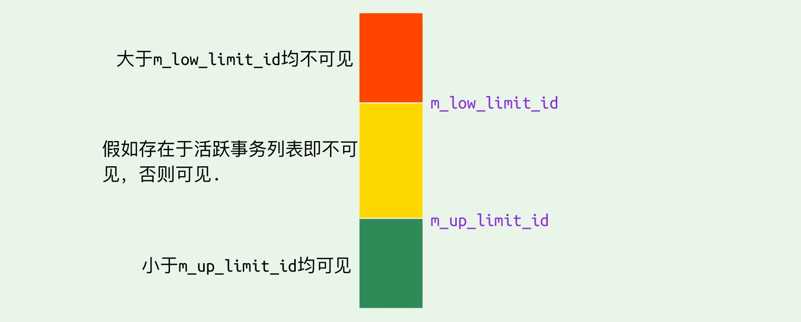

**这种通过「版本链」来控制并发事务访问同一个记录时的行为就叫 MVCC（多版本并发控制）。**

> `undo log` 主要有两个作用：
>
> - 当事务回滚时用于将数据恢复到修改前的样子
> - 另一个作用是 `MVCC` ，当读取记录时，**若该记录被其他事务占用或当前版本对该事务不可见**，则可以通过 `undo log` 读取之前的版本数据，以此实现非锁定读

### RC 和 RR 隔离级别下 MVCC 的差异

在事务隔离级别 `RC` 和 `RR` （InnoDB 存储引擎的默认事务隔离级别）下，`InnoDB` 存储引擎使用 `MVCC`（非锁定一致性读），但它们生成 `Read View` 的时机却不同

- 在 RC 隔离级别下的 **`每次select`** 查询前都生成一个`Read View` (m_ids 列表)

- 在 RR 隔离级别下只在事务开始后 **`第一次select`** 数据前生成一个`Read View`（m_ids 列表）

**这也是`RC`为什么会有`不可重复读`的原因**

## 当前读

如果执行的是下列语句，就是 **当前读/锁定读（Locking Reads）**

- select ... lock in share mode
- select ... for update
- insert、update、delete 操作

在当前读下，读取的是数据的最新版本。当前读会对读取到的记录加锁：

- select ... lock in share mode：对记录加 S 锁，其它事务也可以加S锁，如果加 x 锁则会被阻塞

- select ... for update、insert、update、delete：对记录加 X 锁，且其它事务不能加任何锁

> 在一致性非锁定读下，即使读取的记录已被其它事务加上 X 锁，这时记录也是可以被读取的，即读取快照数据。

在 Repeatable Read 下 MVCC 可以防止部分幻读，指的在 `快照读（一致性非锁定读）`情况下，只能读取到第一次查询之前所插入的数据（根据 Read View 判断数据可见性，Read View 在第一次查询时生成）。

但是如果使用了`当前读` ，每次读取的都是最新数据，这时如果两次查询中间有其它事务插入数据，就会产生幻读（**即下面 `事务#REPEATABLE READ` 小节所举例子**）

## REPEATABLE READ 

> [對於 MySQL Repeatable Read Isolation 常見的三個誤解](https://medium.com/@chester.yw.chu/%E5%B0%8D%E6%96%BC-mysql-repeatable-read-isolation-%E5%B8%B8%E8%A6%8B%E7%9A%84%E4%B8%89%E5%80%8B%E8%AA%A4%E8%A7%A3-7a9afbac65af)
>
> [MySQL · 源码分析 · InnoDB Repeatable Read](https://medium.com/@chester.yw.chu/%E5%B0%8D%E6%96%BC-mysql-repeatable-read-isolation-%E5%B8%B8%E8%A6%8B%E7%9A%84%E4%B8%89%E5%80%8B%E8%AA%A4%E8%A7%A3-7a9afbac65af)

> MySQL的 RR Isolation 的实现采用的是 [Snapshot Islolation](https://medium.com/@chester.yw.chu/複習資料庫的-isolation-level-與常見的五個-race-conditions-圖解-16e8d472a25c)。如果瞭解 Snapshot Isolation 的機制，就可以知道 Snapshot Isolation 在 **read-only Transaction 中才可以避免 Phantom，但是像在像上面的例子使用的 read-write Transaction 中，就有可能出現 Phantom**，進而導致 Write Skew。
> >Snapshot isolation avoids phantoms in read-only queries, but in read-write transactions, phantoms can lead to particularly tricky cases of write skew.
>
> Snapshot Isolation 會在每個 Transaction 第一次 SELECT 資料的時候，記錄下一個概念上像是時間標記的資料，每個 Transaction 在執行完第一次 SELECT 之後，Transaction 就只允許讀取:
>
> 1. 在這個時間標記之前就已經 commit 的資料
>
> 2. Transaction 自己本身對資料庫所做的更動
>
> 這就像對資料庫做了一個 Snapshot 一樣，Transaction 只能看到這個 Snapshot 的內容，但是無法讀取到其他 Transaction 所做的更新。但是在 InnoDB 的實作中，這個規則只限於 SELECT (DQL) 指令，其他像是 INSERT、UPDATE 和 DELETE 等 DML 指令，看到的就不是 Snapshot，而是指令執行當下所有已經被 commit 的資料。所以在上面的例子中，Transaction 在進行 UPDATE 指令時，看到的就是資料庫當下真實的資料，所有已經被 Commit 的資料都包含在內。這也就是為什麼 Transaction A 在執行 UPDATE 時可以看到a=1，並且设置a=3。而且在執行完 UPDATE 後，重新 SELECT 一次時，a=3 也出現在列表中 (Transaction 可以看到自己所做的更新)。

解决方法：
1. **使用MySQL 的 Share Lock 或是 Exclusive Lock 指令，Block 住其它想更改資料的 Transaction例如：SELECT * FROM gamer LOCK IN SHARE MODE;**
2. 隔离级别设置为 Serialzable Isolation，MySQL 就會自動為所有的 SELECT 都加上 LOCK IN SHARE MODE。

> **Innodb 引擎为了解决「可重复读」隔离级别下的幻读问题，就引出了 next-key 锁**

# 锁

> 对记录加锁时，**加锁的基本单位是 next-key lock**，它是由记录锁和间隙锁组合而成的，**next-key lock 是前开后闭区间，而间隙锁是前开后开区间**。

唯一索引等值查询：

- 当查询的记录是存在的，next-key lock 会退化成「记录锁」。
- 当查询的记录是不存在的，next-key lock 会退化成「间隙锁」。

非唯一索引等值查询：

- 当查询的记录存在时，除了会加 next-key lock 外，还额外加间隙锁，也就是会加两把锁。
- 当查询的记录不存在时，只会加 next-key lock，然后会退化为间隙锁，也就是只会加一把锁。

非唯一索引和主键索引的范围查询的加锁规则不同之处在于：

- 唯一索引在满足一些条件的时候，next-key lock 退化为间隙锁和记录锁。

- 非唯一索引范围查询，next-key lock 不会退化为间隙锁和记录锁。

  

> 加锁的位置准确的说，锁是加在索引上的而非行上。
>
> **where 条件没有使用索引，就会全表扫描，于是就会对所有记录加上 next-key 锁（记录锁 + 间隙锁），相当于把整个表锁住了**。
>
> 因此，当在数据量非常大的数据库表执行 update 语句时，如果没有使用索引，就会给全表的加上 next-key 锁， 那么锁就会持续很长一段时间，直到事务结束，而这期间除了 `select ... from`语句，其他语句都会被锁住不能执行
>
> 那 update 语句的 where 带上索引就能避免全表记录加锁了吗？
>
> **关键还得看这条语句在执行过程种，优化器最终选择的是索引扫描，还是全表扫描，如果走了全表扫描，就会对全表的记录加锁了**。

> 当我们要执行 update 语句的时候，确保 where 条件中带上了索引列，并且在测试机确认该语句是否走的是索引扫描，防止因为扫描全表，而对表中的所有记录加上锁。

>  如何避免死锁
>
> - 设置事务等待锁的超时时间， InnoDB 中，参数 `innodb_lock_wait_timeout` 是用来设置超时时间的，默认值时 50 秒。
> - **开启主动死锁检测**。主动死锁检测在发现死锁后，主动回滚死锁链条中的某一个事务，让其他事务得以继续执行。将参数 `innodb_deadlock_detect` 设置为 on，表示开启这个逻辑，默认开启。

[MySQL 死锁了，怎么办？](https://xiaolincoding.com/mysql/lock/deadlock.html#%E4%B8%BA%E4%BB%80%E4%B9%88%E4%BC%9A%E4%BA%A7%E7%94%9F%E6%AD%BB%E9%94%81)

# 日志

## redo log

`redo log`（重做日志）是`InnoDB`存储引擎独有的，它让`MySQL`拥有了崩溃恢复能力。

比如 `MySQL` 实例挂了或宕机了，重启时，`InnoDB`存储引擎会使用`redo log`恢复数据，保证数据的持久性与完整性。

> `MySQL` 中数据是以页为单位，你查询一条记录，会从硬盘把一页的数据加载出来，加载出来的数据叫数据页，会放入到 `Buffer Pool` 中。
>
> 后续的查询都是先从 `Buffer Pool` 中找，没有命中再去硬盘加载，减少硬盘 `IO` 开销，提升性能。
>
> 更新表数据的时候，也是如此，发现 `Buffer Pool` 里存在要更新的数据，就直接在 `Buffer Pool` 里更新。
>
> 然后会把“在某个数据页上做了什么修改”记录到重做日志缓存（`redo log buffer`）里，接着刷盘到 `redo log` 文件里。

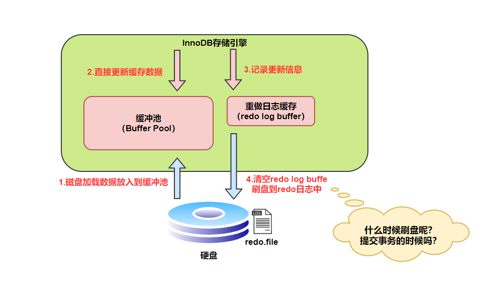

### 刷盘时机

`InnoDB` 存储引擎为 `redo log` 的刷盘策略提供了 `innodb_flush_log_at_trx_commit` 参数，它支持三种策略：

- **0** ：设置为 0 的时候，表示每次事务提交时不进行刷盘操作
- **1** ：设置为 1 的时候，表示每次事务提交时都将进行刷盘操作（默认值）
- **2** ：设置为 2 的时候，表示每次事务提交时都只把 redo log buffer 内容写入 page cache

`innodb_flush_log_at_trx_commit` 参数默认为 1 ，也就是说当事务提交时会调用 `fsync` 对 redo log 进行刷盘

另外，`InnoDB` 存储引擎有一个后台线程，每隔`1` 秒，就会把 `redo log buffer` 中的内容写到文件系统缓存（`page cache`），然后调用 `fsync` 刷盘。

所以：

- 为`0`时，如果`MySQL`挂了或系统宕机可能会有`1`秒数据的丢失。
- 为`1`时， 只要事务提交成功，`redo log`记录就一定在硬盘里，不会有任何数据丢失。如果事务执行期间`MySQL`挂了或系统宕机，这部分日志丢了，但是事务并没有提交，所以日志丢了也不会有损失。
- 为`2`时， 只要事务提交成功，`redo log buffer`中的内容只写入文件系统缓存（`page cache`）。如果仅仅只是`MySQL`挂了不会有任何数据丢失，但是系统宕机可能会有`1`秒数据的丢失。

## binlog

> `redo log` 是物理日志，记录内容是“在某个数据页上做了什么修改”，**属于 `InnoDB` 存储引擎。**

`binlog` 是逻辑日志，记录内容是语句的原始逻辑，类似于“给 ID=2 这一行的 c 字段加 1”，**属于`MySQL Server` 层。**

不管用什么存储引擎，只要发生了表数据更新，都会产生 `binlog` 日志。

可以说`MySQL`数据库的**数据备份、主备、主主、主从**都离不开`binlog`，需要依靠`binlog`来同步数据，保证数据一致性。

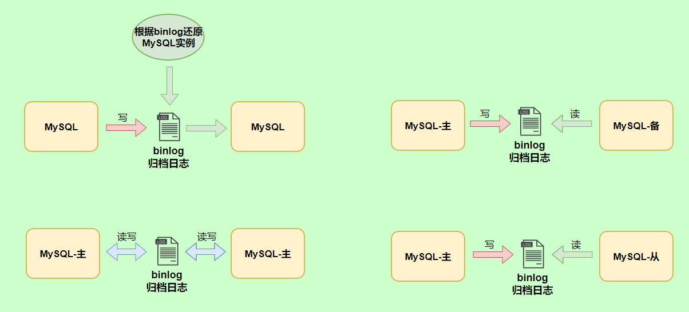

### 三种格式

- `statement`：记录的内容是`SQL`语句原文，比如`update T set update_time=now() where id=1`。同步数据时，会执行记录的`SQL`语句，但是有个问题，`update_time=now()`这里会获取当前系统时间，直接执行会导致与原库的数据不一致。
- `row`：记录的内容不再是简单的`SQL`语句了，还包含操作的具体数据。但是row格式记录的内容看不到详细信息，要通过mysqlbinlog工具解析出来。**通常情况下都是指定为`row`**，可以为数据库的恢复与同步带来更好的可靠性。但是这种格式，需要更大的容量来记录，比较占用空间，恢复与同步时会更消耗`IO`资源，影响执行速度。
- `mixed：`是一种折中的方案，记录的内容是前两者的混合。`MySQL`会判断这条`SQL`语句是否可能引起数据不一致，如果是，就用`row`格式，否则就用`statement`格式。

### 写入机制

`binlog`的写入时机也非常简单，事务执行过程中，先把日志写到`binlog cache`，事务提交的时候，再把`binlog cache`写到`binlog`文件中。

因为一个事务的`binlog`不能被拆开，无论这个事务多大，也要确保一次性写入，所以系统会给每个线程分配一个块内存作为`binlog cache`。

我们可以通过`binlog_cache_size`参数控制单个线程 binlog cache 大小，如果存储内容超过了这个参数，就要暂存到磁盘（`Swap`）。

`binlog`日志刷盘流程如下

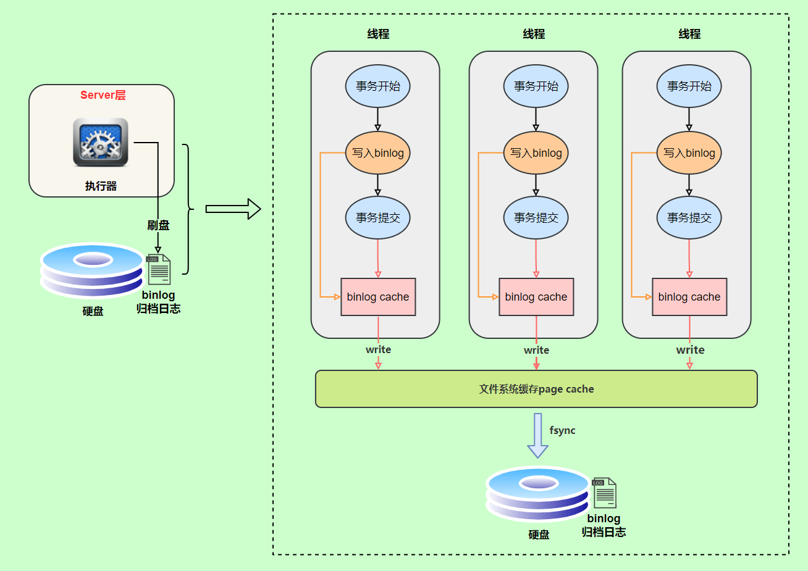

- **上图的 write，是指把日志写入到文件系统的 page cache，并没有把数据持久化到磁盘，所以速度比较快**
- **上图的 fsync，才是将数据持久化到磁盘的操作**

`write`和`fsync`的时机，**由参数`sync_binlog`控制**，默认是`0`。

为`0`的时候，表示每次提交事务都只`write`，由系统自行判断什么时候执行`fsync`

虽然性能得到提升，但是机器宕机，`page cache`里面的 binlog 会丢失。

为了安全起见，可以设置为`1`，表示每次提交事务都会执行`fsync`，就如同 **redo log 日志刷盘流程** 一样。

最后还有一种折中方式，可以设置为`N(N>1)`，表示每次提交事务都`write`，但累积`N`个事务后才`fsync`。

在出现`IO`瓶颈的场景里，将`sync_binlog`设置成一个比较大的值，可以提升性能。

同样的，如果机器宕机，会丢失最近`N`个事务的`binlog`日志。

## redolog和binlog区别

- redo log 是 InnoDB 引擎特有的；binlog 是 MySQL 的 Server 层实现的，所有引擎都可以使用。
- redo log 是物理日志，记录的是“在某个数据页上做了什么修改”；binlog 是逻辑日志，记录的是这个语句的原始逻辑，比如“给 ID=2 这一行的 c 字段加 1 ”。
- redo log 是循环写的，空间固定会用完；binlog 是可以追加写入的。“追加写”是指 binlog 文件写到一定大小后会切换到下一个，**并不会覆盖以前的日志**。

## 两阶段提交

`redo log`（重做日志）让`InnoDB`存储引擎拥有了崩溃恢复能力。

`binlog`（归档日志）保证了`MySQL`集群架构的数据一致性。

> 在执行更新语句过程，会记录`redo log`与`binlog`两块日志，以基本的事务为单位，`redo log`在事务执行过程中可以不断写入，而`binlog`只有在提交事务时才写入，所以`redo log`与`binlog`的写入时机不一样。

为了解决两份日志之间的逻辑一致问题，`InnoDB`存储引擎使用**两阶段提交**方案。

原理很简单，将`redo log`的写入拆成了两个步骤`prepare`和`commit`，这就是**两阶段提交**。

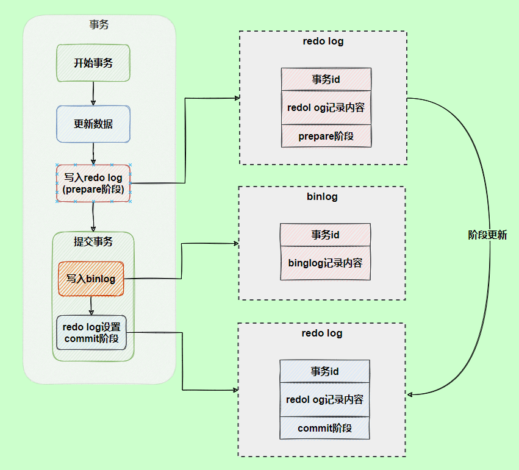

- 使用**两阶段提交**后，写入`binlog`时发生异常也不会有影响，因为`MySQL`根据`redo log`日志恢复数据时，发现`redo log`还处于`prepare`阶段，并且没有对应`binlog`日志，就会回滚该事务。

- `redo log`设置`commit`阶段发生异常，那会不会回滚事务呢？并不会回滚事务，它会执行上图框住的逻辑，虽然`redo log`是处于`prepare`阶段，但是能通过事务`id`找到对应的`binlog`日志，所以`MySQL`认为是完整的，就会提交事务恢复数据。

  >用反证法来说明下为什么使用两阶段提交？
  >
  >- **先写 redo log 直接提交，然后写 binlog**，假设写完 redo log 后，机器挂了，binlog 日志没有被写入，那么机器重启后，这台机器会通过 redo log 恢复数据，但是这个时候 binlog 并没有记录该数据，后续进行机器备份的时候，就会丢失这一条数据，同时主从同步也会丢失这一条数据。
  >
  >- **先写 binlog，然后写 redo log**，假设写完了 binlog，机器异常重启了，由于没有 redo log，本机是无法恢复这一条记录的，但是 binlog 又有记录，那么和上面同样的道理，就会产生数据不一致的情况。
  >如果采用 redo log 两阶段提交的方式就不一样了，写完 binlog 后，然后再提交 redo log 就会防止出现上述的问题，从而保证了数据的一致性。那么问题来了，有没有一个极端的情况呢？假设 redo log 处于预提交状态，binlog 也已经写完了，这个时候发生了异常重启会怎么样呢？ 这个就要依赖于 MySQL 的处理机制了，MySQL 的处理过程如下：
  >- 判断 redo log 是否完整，如果判断是完整的，就立即提交。
  >- 如果 redo log 只是预提交但不是 commit 状态，这个时候就会去判断 binlog 是否完整，如果完整就提交 redo log, 不完整就回滚事务。

## undo log

我们知道如果想要保证事务的原子性，就需要在异常发生时，对已经执行的操作进行**回滚**，恢复机制是通过 **回滚日志（undo log）** 实现的，所有事务进行的修改都会先记录到这个回滚日志中，然后再执行相关的操作。如果执行过程中遇到异常的话，我们直接利用 **回滚日志** 中的信息将数据回滚到修改之前的样子即可！并且，回滚日志会先于数据持久化到磁盘上。这样就保证了即使遇到数据库突然宕机等情况，当用户再次启动数据库的时候，数据库还能够通过查询回滚日志来回滚将之前未完成的事务。

另外，`MVCC` 的实现依赖于：**隐藏字段、Read View、undo log**。在内部实现中，`InnoDB` 通过数据行的 `DB_TRX_ID` 和 `Read View` 来判断数据的可见性，如不可见，则通过数据行的 `DB_ROLL_PTR` 找到 `undo log` 中的历史版本。每个事务读到的数据版本可能是不一样的，在同一个事务中，用户只能看到该事务创建 `Read View` 之前已经提交的修改和该事务本身做的修改

> 由于 roll_pointer 的存在，整个数据库中的每行数据，背后都可能有不止一条数据，每个 transaction 的修改都会在表中留下痕迹，而它们通过 roll_pointer 形成了一个类似于单向链表的数据结构，我们称为版本链。所以每次新插入一条数据，除了插入数据本身和申请事务 ID，我们也要记得把 pointer 指向此前数据的 undo_log。

# Buffer Pool

Innodb 存储引擎设计了一个**缓冲池（Buffer Pool）**，来提高数据库的读写性能。

Buffer Pool 以页为单位缓冲数据，可以通过 `innodb_buffer_pool_size` 参数调整缓冲池的大小，默认是 128 M。

Innodb 通过三种链表来管理缓页：

- Free List （空闲页链表），管理空闲页；
- Flush List （脏页链表），管理脏页；
- LRU List，管理脏页+干净页，将最近且经常查询的数据缓存在其中，而不常查询的数据就淘汰出去。；

InnoDB 对 LRU 做了一些优化，我们熟悉的 LRU 算法通常是将最近查询的数据放到 LRU 链表的头部，而 InnoDB 做 2 点优化：

- 将 LRU 链表 分为**young 和 old 两个区域**，加入缓冲池的页，优先插入 old 区域；页被访问时，才进入 young 区域，目的是为了解决预读失效的问题。
- 当**「页被访问」且「 old 区域停留时间超过 `innodb_old_blocks_time` 阈值（默认为1秒）」**时，才会将页插入到 young 区域，否则还是插入到 old 区域，目的是为了解决批量数据访问，大量热数据淘汰的问题。

可以通过调整 `innodb_old_blocks_pc` 参数，设置 young 区域和 old 区域比例。

在开启了慢 SQL 监控后，如果你发现「偶尔」会出现一些用时稍长的 SQL，这可因为脏页在刷新到磁盘时导致数据库性能抖动。如果在很短的时间出现这种现象，就需要调大 Buffer Pool 空间或 redo log 日志的大小。

# 一条sql的执行流程

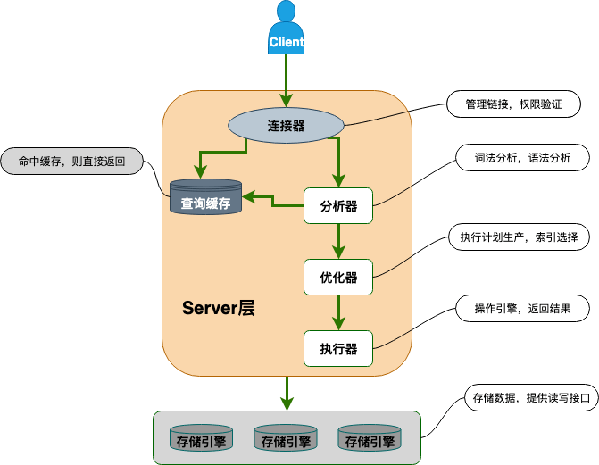

简单来说 MySQL 主要分为 Server 层和存储引擎层：

- **Server 层**：主要包括连接器、查询缓存、分析器、优化器、执行器等，所有跨存储引擎的功能都在这一层实现，比如存储过程、触发器、视图，函数等，还有一个通用的日志模块 binlog 日志模块。
- **存储引擎**： 主要负责数据的存储和读取，采用可以替换的插件式架构，支持 InnoDB、MyISAM、Memory 等多个存储引擎，其中 InnoDB 引擎有自有的日志模块 redolog 模块。**现在最常用的存储引擎是 InnoDB，它从 MySQL 5.5.5 版本开始就被当做默认存储引擎了。**

# 一条完整的 SELECT 语句内部的执行顺序

- FROM 子句组装数据（包括通过 ON 进行连接）；

- WHERE 子句进行条件筛选；

- GROUP BY 分组 ；

- 使用聚集函数进行计算；

- HAVING 筛选分组；

- 计算所有的表达式；

- SELECT 的字段；

- ORDER BY 排序；

- LIMIT 筛选。

  > 首先，你可以注意到，SELECT 是先执行 FROM 这一步的。
  >
  > 在这个阶段，如果是多张表联查，还会经历下面的几个步骤：
  >
  > 首先先通过 CROSS JOIN 求笛卡尔积，相当于得到虚拟表 vt（virtual table）1-1；
  >
  > 通过 ON 进行筛选，在虚拟表 vt1-1 的基础上进行筛选，得到虚拟表 vt1-2；添加外部行。
  >
  > 如果我们使用的是左连接、右链接或者全连接，就会涉及到外部行，也就是在虚拟表 vt1-2 的基础上增加外部行，得到虚拟表 vt1-3。
  >
  > 当然如果我们操作的是两张以上的表，还会重复上面的步骤，直到所有表都被处理完为止。
  >
  > 这个过程得到是我们的原始数据。当我们拿到了查询数据表的原始数据，也就是最终的虚拟表 vt1，就可以在此基础上再进行 WHERE 阶段。
  >
  > 在这个阶段中，会根据 vt1 表的结果进行筛选过滤，得到虚拟表 vt2。然后进入第三步和第四步，也就是 GROUP 和 HAVING 阶段。在这个阶段中，实际上是在虚拟表 vt2 的基础上进行分组和分组过滤，得到中间的虚拟表 vt3 和 vt4。
  >
  > 当我们完成了条件筛选部分之后，就可以筛选表中提取的字段，也就是进入到 SELECT 和 DISTINCT 阶段。首先在 SELECT 阶段会提取想要的字段，然后在 DISTINCT 阶段过滤掉重复的行，分别得到中间的虚拟表 vt5-1 和 vt5-2。
  >
  > 当我们提取了想要的字段数据之后，就可以按照指定的字段进行排序，也就是 ORDER BY 阶段，得到虚拟表 vt6。最后在 vt6 的基础上，取出指定行的记录，也就是 LIMIT 阶段，得到最终的结果，对应的是虚拟表 vt7。

# todo 主从

# todo 分库分表