# 单线程redis？

> Redis 是单线程，主要是指 Redis 的网络 IO 和键值对读写是由一个线程来完成的，这也是 Redis 对外提供键值存储服务的主要流程。但 Redis 的其他功能，比如持久化、异步删除、集群数据同步等，其实是由额外的线程执行的。

> Redis 单线程是指它对网络 IO 和数据读写的操作采用了一个线程，而采用单线程的一个核心原因是避免多线程开发的并发控制问题。单线程的 Redis 也能获得高性能，跟多路复用的 IO 模型密切相关，因为这避免了 accept() 和 send()/recv() 潜在的网络 IO 操作阻塞点。

# 数据类型

- string：基于redis自己构建的 **简单动态字符串**（simple dynamic string，**SDS**）实现。`set,get,strlen,exists,decr,incr,setex`
- list：集合。`rpush,lpop,lpush,rpop,lrange,llen`
- hash：map。`hset,hmset,hexists,hget,hgetall,hkeys,hvals`
- set：去重List。`sadd,spop,smembers,sismember,scard,sinterstore,sunion`
- sorted set：增加`score`参数，有序set。`zadd,zcard,zscore,zrange,zrevrange,zrem`
- bitmap：位图。`setbit` 、`getbit` 、`bitcount`、`bitop`

# 数据结构

> [Redis数据结构]()

## Redis如何保存所有`key-value`缓存数据的？

Redis 使用了一个「哈希表」保存所有键值对，哈希表的最大好处就是让我们可以用 O(1) 的时间复杂度来快速查找到键值对。哈希表其实就是一个数组，数组中的元素叫做哈希桶。

哈希桶存放的是指向键值对数据的指针（dictEntry*），这样通过指针就能找到键值对数据，然后因为键值对的值可以保存字符串对象和集合数据类型的对象，所以键值对的数据结构中**并不是直接保存值本身，而是保存了 void * key 和 void * value 指针**，分别指向了实际的键对象和值对象，这样一来，即使值是集合数据，也可以通过 void * value 指针找到。

结构如下：

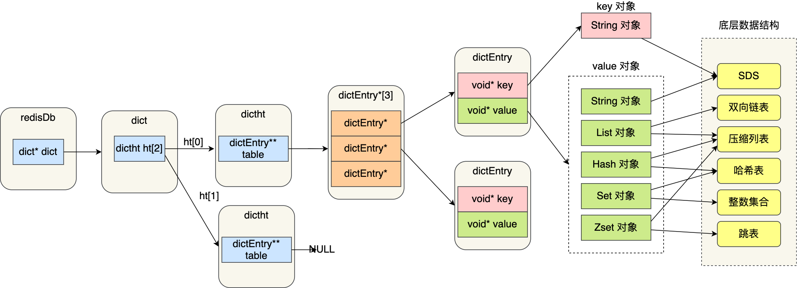

- redisDb 结构，表示 Redis 数据库的结构，结构体里存放了指向了 dict 结构的指针；
- dict 结构，结构体里存放了 2 个哈希表，正常情况下都是用「哈希表1」，「哈希表2」只有在 rehash 的时候才用
- ditctht 结构，表示哈希表的结构，结构里存放了哈希表数组，数组中的每个元素都是指向一个哈希表节点结构（dictEntry）的指针；
- dictEntry 结构，表示哈希表节点的结构，结构里存放了 **void * key 和 void * value 指针， *key 指向的是 String 对象，而 \*value 则可以指向 String 对象，也可以指向集合类型的对象，比如 List 对象、Hash 对象、Set 对象和 Zset 对象**。

而 Redis 中的每个对象都由 redisObject 结构表示，如下图：

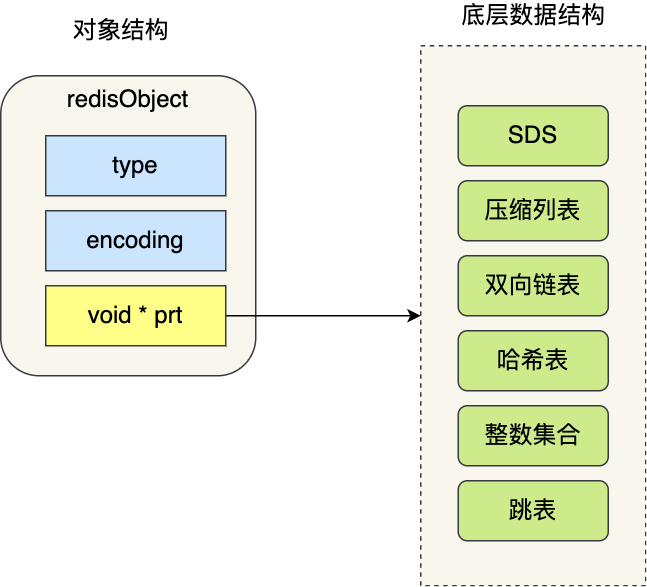

- type，标识该对象是什么类型的对象（String 对象、 List 对象、Hash 对象、Set 对象和 Zset 对象）；
- encoding，标识该对象使用了哪种底层的数据结构；
- **ptr，指向底层数据结构的指针**。

## 数据类型对应的数据结构


## SDS

### 背景

 >C 语言的字符串不足之处以及可以改进的地方：

- 获取字符串长度的时间复杂度为 O（N）；
- 字符串的结尾是以 “\0” 字符标识，字符串里面不能包含有 “\0” 字符，因此不能保存二进制数据；
- 字符串操作函数不高效且不安全，比如有缓冲区溢出的风险，有可能会造成程序运行终止；

### SDS 结构设计

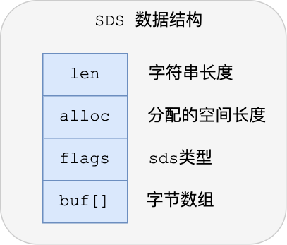

- **len，记录了字符串长度**。这样获取字符串长度的时候，只需要返回这个成员变量值就行，时间复杂度只需要 O（1）。
- **alloc，分配给字符数组的空间长度**。这样在修改字符串的时候，可以通过 `alloc - len` 计算出剩余的空间大小，可以用来判断空间是否满足修改需求，如果不满足的话，就会自动将 SDS 的空间扩展至执行修改所需的大小，然后才执行实际的修改操作，所以使用 SDS 既不需要手动修改 SDS 的空间大小，也不会出现前面所说的缓冲区溢出的问题。
- **flags，用来表示不同类型的 SDS**。一共设计了 5 种类型，分别是 sdshdr5、sdshdr8、sdshdr16、sdshdr32 和 sdshdr64，后面在说明区别之处。
- **buf[]，字节数组，用来保存实际数据**。不仅可以保存字符串，也可以保存二进制数据。

通过以上变量实现了

- #### O（1）复杂度获取字符串长度

- #### 二进制安全

- #### 节省内存空间

  SDS 结构中有个 flags 成员变量，表示的是 SDS 类型。

  Redos 一共设计了 5 种类型，分别是 sdshdr5、sdshdr8、sdshdr16、sdshdr32 和 sdshdr64。

  这 5 种类型的主要**区别就在于，它们数据结构中的 len 和 alloc 成员变量的数据类型不同**。

  比如 sdshdr16 和 sdshdr32 这两个类型：

  ```c
  struct __attribute__ ((__packed__)) sdshdr16 {
      uint16_t len;
      uint16_t alloc; 
      unsigned char flags; 
      char buf[];
  };
  
  
  struct __attribute__ ((__packed__)) sdshdr32 {
      uint32_t len;
      uint32_t alloc; 
      unsigned char flags;
      char buf[];
  };  
  ```
  - sdshdr16 类型的 len 和 alloc 的数据类型都是 uint16_t，表示字符数组长度和分配空间大小不能超过 2 的 16 次方。
  - sdshdr32 则都是 uint32_t，表示表示字符数组长度和分配空间大小不能超过 2 的 32 次方。
  
  从而实现了节省内存空间

## 链表

### 结构

```c
typedef struct listNode {
    //前置节点
    struct listNode *prev;
    //后置节点
    struct listNode *next;
    //节点的值
    void *value;
} listNode;

typedef struct list {
    //链表头节点
    listNode *head;
    //链表尾节点
    listNode *tail;
    //节点值复制函数
    void *(*dup)(void *ptr);
    //节点值释放函数
    void (*free)(void *ptr);
    //节点值比较函数
    int (*match)(void *ptr, void *key);
    //链表节点数量
    unsigned long len;
} list;
```
### 优点

- 提供了表头指针 head 和表尾指针 tail，所以获取头尾节点的时间复杂度只需O(1)。`并且是无环链表`

- 获取链表中的节点数量的时间复杂度只需O(1)；

- listNode 链表节使用 void* 指针保存节点值，并且可以通过 list 结构的 dup、free、match 函数指针为节点设置该节点类型特定的函数，因此链表节点可以保存各种不同类型的值；

### 缺点

- 因为是链表（内存不连续），意味着无法很好利用 CPU 缓存（局限性原理）
- 就算只有一个节点也需要一个链表节点结构头的分配，内存开销较大。

所以，**Redis 3.0 的 List 对象在数据量比较少的情况下，会采用「压缩列表」作为底层数据结构的实现**，它的优势是**节省内存空间**，并且是内存紧凑型的数据结构。

不过，压缩列表存在性能问题，所以 Redis 在 3.2 版本设计了新的数据结构 **quicklist**，并将 List 对象的底层数据结构改由 quicklist 实现。

> 然后在 Redis 5.0 设计了新的数据结构 **listpack**，沿用了压缩列表紧凑型的内存布局，最终在 github 最新的 Redis 版本，将 Hash 对象和 Zset 对象的底层数据结构实现之一的压缩列表，替换成由 listpack 实现。

## 压缩列表

> [这里只做简单了解，详细看这里](https://xiaolincoding.com/redis/data_struct/data_struct.html#%E5%8E%8B%E7%BC%A9%E5%88%97%E8%A1%A8%E7%BB%93%E6%9E%84%E8%AE%BE%E8%AE%A1)

数组．压缩列表节点包含三部分内容：

- ***prevlen***，记录了「前一个节点」的长度；
- ***encoding***，记录了当前节点实际数据的类型以及长度；（encoding 属性的空间大小跟数据是字符串还是整数，以及字符串的长度有）
- ***data***，记录了当前节点的实际数据；

prevlen 属性的**空间大小**跟前一个节点长度值有关，这就导致了**新插入的元素较大时，可能会导致后续元素的 prevlen 占用空间都发生变化，从而引起「连锁更新」问题，导致每个元素的空间都要重新分配，造成访问压缩列表性能的下降**。

因此连锁更新一旦发生，就会导致压缩列表占用的内存空间要多次重新分配，这就会直接影响到压缩列表的访问性能。

因此，**压缩列表只会用于保存的节点数量不多的场景**，只要节点数量足够小，即使发生连锁更新，也是能接受的。

虽说如此，Redis 针对压缩列表在设计上的不足，在后来的版本中，新增设计了两种数据结构：quicklist（Redis 3.2 引入） 和 listpack（Redis 5.0 引入）。这两种数据结构的设计目标，就是尽可能地保持压缩列表节省内存的优势，同时解决压缩列表的「连锁更新」的问题。

## 哈希表

Redis 采用了「链式哈希」来解决哈希冲突


### 结构

```c
typedef struct dictht {
    //哈希表数组
    dictEntry **table;
    //哈希表大小
    unsigned long size;  
    //哈希表大小掩码，用于计算索引值
    unsigned long sizemask;
    //该哈希表已有的节点数量
    unsigned long used;
} dictht;

typedef struct dictEntry {
    //键值对中的键
    void *key;
  
    //键值对中的值
    union {
        void *val;
        uint64_t u64;
        int64_t s64;
        double d;
    } v;
    //指向下一个哈希表节点，形成链表
    struct dictEntry *next;
} dictEntry;
```
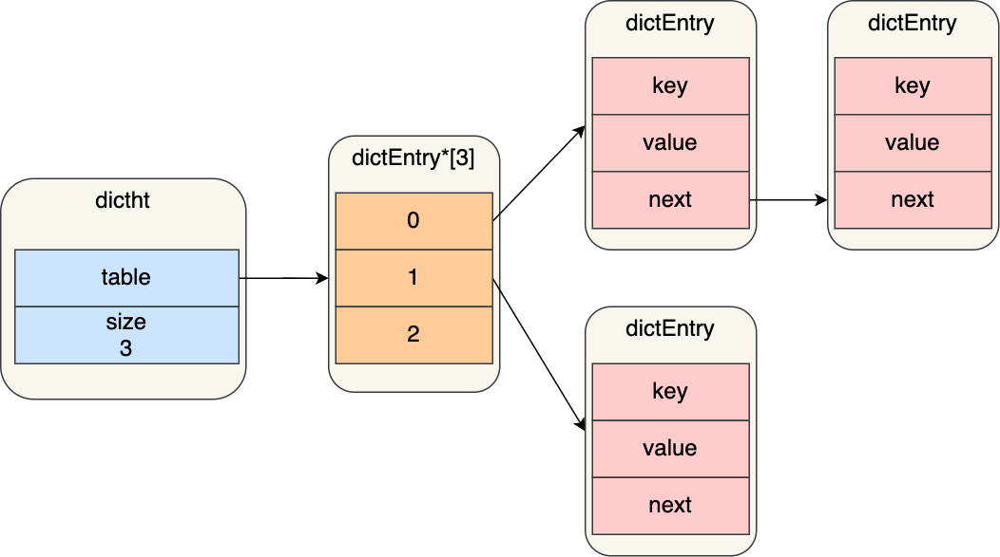

> dictEntry 结构里键值对中的值是一个「联合体 v」定义的，因此，键值对中的值可以是一个指向实际值的指针，或者是一个无符号的 64 位整数或有符号的 64 位整数或double 类的值。这么做的好处是可以节省内存空间，因为当「值」是整数或浮点数时，就可以将值的数据内嵌在 dictEntry 结构里，无需再用一个指针指向实际的值，从而节省了内存空间。

### rehash

以 `Redis如何保存所有`key-value`缓存数据的？`小节的`redis dict`结构为例:

```c
typedef struct dict {
    …
    //两个Hash表，交替使用，用于rehash操作
    dictht ht[2]; 
    …
} dict;
```

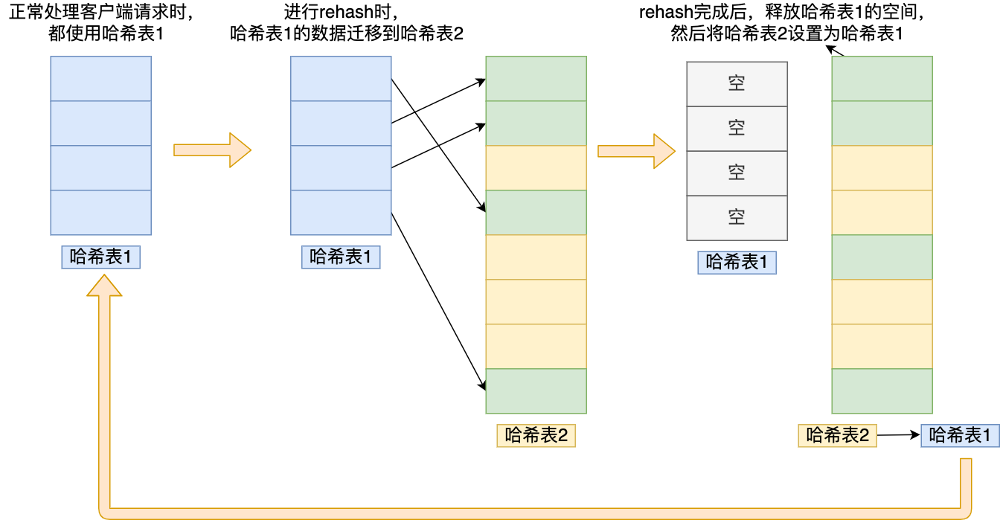

这个过程看起来简单，但是其实第二步很有问题，**如果「哈希表 1 」的数据量非常大，那么在迁移至「哈希表 2 」的时候，因为会涉及大量的数据拷贝，此时可能会对 Redis 造成阻塞，无法服务其他请求**。

为了避免 rehash 在数据迁移过程中，因拷贝数据的耗时，影响 Redis 性能的情况，所以 Redis 采用了**渐进式 rehash**，也就是将数据的迁移的工作不再是一次性迁移完成，而是分多次迁移。

渐进式 rehash 步骤如下：

- 给「哈希表 2」 分配空间；
- **在 rehash 进行期间，每次哈希表元素进行新增、删除、查找或者更新操作时，Redis 除了会执行对应的操作之外，还会顺序将「哈希表 1 」中索引位置上的所有 key-value 迁移到「哈希表 2」 上**；
- 随着处理客户端发起的哈希表操作请求数量越多，最终在某个时间点，会把「哈希表 1 」的所有 key-value 迁移到「哈希表 2」，从而完成 rehash 操作。

所以在渐进式 rehash 进行期间，哈希表元素的删除、查找、更新等操作都会在这两个哈希表进行。

比如，查找一个 key 的值的话，先会在「哈希表 1」 里面进行查找，如果没找到，就会继续到哈希表 2 里面进行找到。

另外，在渐进式 rehash 进行期间，新增一个 key-value 时，会被保存到「哈希表 2 」里面，而「哈希表 1」 则不再进行任何添加操作，这样保证了「哈希表 1 」的 key-value 数量只会减少，随着 rehash 操作的完成，最终「哈希表 1 」就会变成空表。

rehash触发条件

rehash 的触发条件跟**负载因子（load factor）**有关系。

`负载因子 = 哈希表已保存节点数量 / 哈希表大小`

- **当负载因子大于等于 1 小于5，并且 Redis 没有在执行 bgsave 命令或者 bgrewiteaof 命令，也就是没有执行 RDB 快照或没有进行 AOF 重写的时候，就会进行 rehash 操作。**
- **当负载因子大于等于 5 时，此时说明哈希冲突非常严重了，不管有没有在执行 RDB 快照或 AOF 重写，都会强制进行 rehash 操作。**

## 整数集合

> [具体看这里](https://xiaolincoding.com/redis/data_struct/data_struct.html#%E6%95%B4%E6%95%B0%E9%9B%86%E5%90%88%E7%9A%84%E5%8D%87%E7%BA%A7%E6%93%8D%E4%BD%9C)

```c
typedef struct intset {
    //编码方式
    uint32_t encoding;
    //集合包含的元素数量
    uint32_t length;
    //保存元素的数组
    int8_t contents[];
} intset;
```
虽然 contents 被声明为 int8_t 类型的数组，但是实际上 contents 数组并不保存任何 int8_t 类型的元素，contents 数组的真正类型取决于 intset 结构体里的 encoding 属性的值。比如：

- 如果 encoding 属性值为 INTSET_ENC_INT16，那么 contents 就是一个 int16_t 类型的数组，数组中每一个元素的类型都是 int16_t；
- 如果 encoding 属性值为 INTSET_ENC_INT32，那么 contents 就是一个 int32_t 类型的数组，数组中每一个元素的类型都是 int32_t；
- 如果 encoding 属性值为 INTSET_ENC_INT64，那么 contents 就是一个 int64_t 类型的数组，数组中每一个元素的类型都是 int64_t；

所以这里会有数组升级的概念

> 如果一直向整数集合添加 int16_t 类型的元素，那么整数集合的底层实现就一直是用 int16_t 类型的数组，只有在我们要将 int32_t 类型或 int64_t 类型的元素添加到集合时，才会对数组进行升级操作。

**但是不支持降级操作**，一旦对数组进行了升级，就会一直保持升级后的状态。

## 跳表

Redis 只有在 Zset 对象的底层实现用到了跳表，跳表的优势是能支持平均 O(logN) 复杂度的节点查找。

链表在查找元素的时候，因为需要逐一查找，所以查询效率非常低，时间复杂度是O(N)，于是就出现了跳表。**跳表是在链表基础上改进过来的，实现了一种「多层」的有序链表**，这样的好处是能快读定位数据 **(平均 O(logN) 复杂度查找)**。

#### 结构

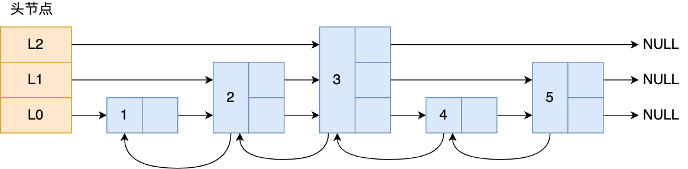

图中头节点有 L0~L2 三个头指针，分别指向了不同层级的节点，然后每个层级的节点都通过指针连接起来：

- L0 层级共有 5 个节点，分别是节点1、2、3、4、5；
- L1 层级共有 3 个节点，分别是节点 2、3、5；
- L2 层级只有 1 个节点，也就是节点 3 。

如果我们要在链表中查找节点 4 这个元素，只能从头开始遍历链表，需要查找 4 次，而使用了跳表后，只需要查找 2 次就能定位到节点 4，因为可以在头节点直接从 L2 层级跳到节点 3，然后再往前遍历找到节点 4。

可以看到，这个查找过程就是在多个层级上跳来跳去，最后定位到元素。当数据量很大时，跳表的查找复杂度就是 O(logN)。

```c
typedef struct zskiplistNode {
    //Zset 对象的元素值
    sds ele;
    //元素权重值
    double score;
    //后向指针
    struct zskiplistNode *backward;
  
    //节点的level数组，保存每层上的前向指针和跨度
    struct zskiplistLevel {
        struct zskiplistNode *forward;
        unsigned long span;
    } level[];
} zskiplistNode;
```
Zset 对象要同时保存元素和元素的权重，对应到跳表节点结构里就是 sds 类型的 ele 变量和 double 类型的 score 变量。每个跳表节点都有一个后向指针，指向前一个节点，目的是为了方便从跳表的尾节点开始访问节点，这样倒序查找时很方便。

跳表是一个带有层级关系的链表，而且每一层级可以包含多个节点，每一个节点通过指针连接起来，实现这一特性就是靠跳表节点结构体中的zskiplistLevel 结构体类型的 level 数组。

level 数组中的每一个元素代表跳表的一层，也就是由 zskiplistLevel 结构体表示，比如 leve[0] 就表示第一层，leve[1] 就表示第二层。zskiplistLevel 结构体里定义了「指向下一个跳表节点的指针」和「跨度」，跨度时用来记录两个节点之间的距离。

比如，下面这张图，展示了各个节点的跨度。

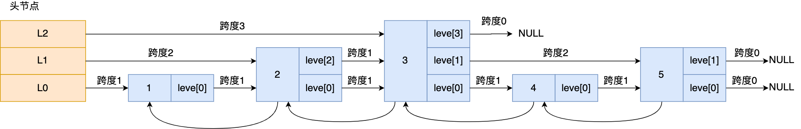

第一眼看到跨度的时候，以为是遍历操作有关，实际上并没有任何关系，遍历操作只需要用前向指针就可以完成了。

跨度实际上是为了计算这个节点在跳表中的排位。具体怎么做的呢？因为跳表中的节点都是按序排列的，那么计算某个节点排位的时候，从头节点点到该结点的查询路径上，将沿途访问过的所有层的跨度累加起来，得到的结果就是目标节点在跳表中的排位。

举个例子，查找图中节点 3 在跳表中的排位，从头节点开始查找节点 3，查找的过程只经过了一个层（L3），并且层的跨度是 3，所以节点 3 在跳表中的排位是 3。

另外，图中的头节点其实也是 zskiplistNode 跳表节点，只不过头节点的后向指针、权重、元素值都会被用到，所以图中省略了这部分。

问题来了，由谁定义哪个跳表节点是头节点呢？这就介绍「跳表」结构体了，如下所示：

```c
typedef struct zskiplist {
    struct zskiplistNode *header, *tail;
    unsigned long length;
    int level;
} zskiplist;
```


跳表结构里包含了：

- 跳表的头尾节点，便于在O(1)时间复杂度内访问跳表的头节点和尾节点；
- 跳表的长度，便于在O(1)时间复杂度获取跳表节点的数量；
- 跳表的最大层数，便于在O(1)时间复杂度获取跳表中层高最大的那个节点的层数量；

#### 跳表节点查询过程

查找一个跳表节点的过程时，跳表会从头节点的最高层开始，逐一遍历每一层。在遍历某一层的跳表节点时，会用跳表节点中的 SDS 类型的元素和元素的权重来进行判断，共有两个判断条件：

- 如果当前节点的权重「小于」要查找的权重时，跳表就会访问该层上的下一个节点。
- 如果当前节点的权重「等于」要查找的权重时，并且当前节点的 SDS 类型数据「小于」要查找的数据时，跳表就会访问该层上的下一个节点。
如果上面两个条件都不满足，或者下一个节点为空时，跳表就会使用目前遍历到的节点的 level 数组里的下一层指针，然后沿着下一层指针继续查找，这就相当于跳到了下一层接着查找。

举个例子，下图有个 3 层级的跳表。

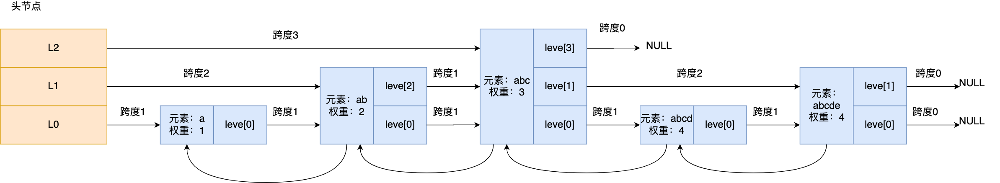

如果要查找「元素：abcd，权重：4」的节点，查找的过程是这样的：

先从头节点的最高层开始，L2 指向了「元素：abc，权重：3」节点，这个节点的权重比要查找节点的小，所以要访问该层上的下一个节点；
但是该层上的下一个节点是空节点，于是就会跳到「元素：abc，权重：3」节点的下一层去找，也就是 leve[1];
「元素：abc，权重：3」节点的 leve[1] 的下一个指针指向了「元素：abcde，权重：4」的节点，然后将其和要查找的节点比较。虽然「元素：abcde，权重：4」的节点的权重和要查找的权重相同，但是当前节点的 SDS 类型数据「大于」要查找的数据，所以会继续跳到「元素：abc，权重：3」节点的下一层去找，也就是 leve[0]；
「元素：abc，权重：3」节点的 leve[0] 的下一个指针指向了「元素：abcd，权重：4」的节点，该节点正是要查找的节点，查询结束。

#### 跳表节点层数设置
跳表的相邻两层的节点数量的比例会影响跳表的查询性能。

举个例子，下图的跳表，第二层的节点数量只有 1 个，而第一层的节点数量有 6 个。

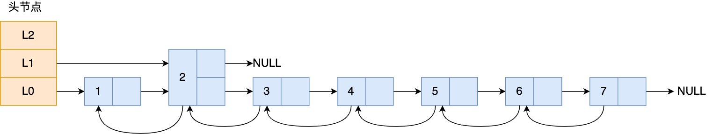

这时，如果想要查询节点 6，那基本就跟链表的查询复杂度一样，就需要在第一层的节点中依次顺序查找，复杂度就是 O(N) 了。所以，为了降低查询复杂度，我们就需要维持相邻层结点数间的关系。

跳表的相邻两层的节点数量最理想的比例是 2:1，查找复杂度可以降低到 O(logN)。

下图的跳表就是，相邻两层的节点数量的比例是 2 : 1。

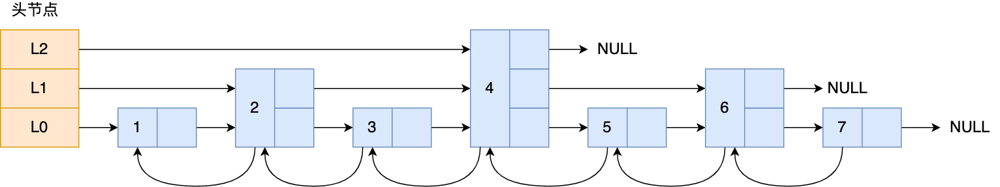

那怎样才能维持相邻两层的节点数量的比例为 2 : 1 呢？

如果采用新增节点或者删除节点时，来调整跳表节点以维持比例的方法的话，会带来额外的开销。

Redis 则采用一种巧妙的方法是，跳表在创建节点的时候，随机生成每个节点的层数，并没有严格维持相邻两层的节点数量比例为 2 : 1 的情况。

具体的做法是，跳表在创建节点时候，会生成范围为[0-1]的一个随机数，如果这个随机数小于 0.25（相当于概率 25%），那么层数就增加 1 层，然后继续生成下一个随机数，直到随机数的结果大于 0.25 结束，最终确定该节点的层数。

这样的做法，相当于每增加一层的概率不超过 25%，层数越高，概率越低，层高最大限制是 64。

## quicklist

在 Redis 3.0 之前，List 对象的底层数据结构是双向链表或者压缩列表。然后在 Redis 3.2 的时候，List 对象的底层改由 quicklist 数据结构实现。

quicklist 就是**「双向链表 + 压缩列表」**组合，因为一个 quicklist 就是一个链表，而链表中的每个元素又是一个压缩列表。

在前面讲压缩列表的时候，我也提到了压缩列表的不足，虽然压缩列表是通过紧凑型的内存布局节省了内存开销，但是因为它的结构设计，如果保存的元素数量增加，或者元素变大了，压缩列表会有「连锁更新」的风险，一旦发生，会造成性能下降。

quicklist 解决办法，**通过控制每个链表节点中的压缩列表的大小或者元素个数，来规避连锁更新的问题。因为压缩列表元素越少或越小，连锁更新带来的影响就越小，从而提供了更好的访问性能。**

### 结构

```c
typedef struct quicklist {
    //quicklist的链表头
    quicklistNode *head;      //quicklist的链表头
    //quicklist的链表头
    quicklistNode *tail; 
    //所有压缩列表中的总元素个数
    unsigned long count;
    //quicklistNodes的个数
    unsigned long len;       
    ...
} quicklist;

typedef struct quicklistNode {
    //前一个quicklistNode
    struct quicklistNode *prev;     //前一个quicklistNode
    //下一个quicklistNode
    struct quicklistNode *next;     //后一个quicklistNode
    //quicklistNode指向的压缩列表
    unsigned char *zl;              
    //压缩列表的的字节大小
    unsigned int sz;                
    //压缩列表的元素个数
    unsigned int count : 16;        //ziplist中的元素个数 
    ....
} quicklistNode;
```
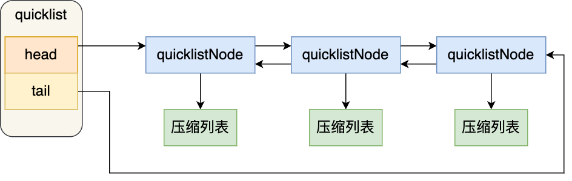


在向 quicklist 添加一个元素的时候，不会像普通的链表那样，直接新建一个链表节点。而是会检查插入位置的压缩列表是否能容纳该元素，如果能容纳就直接保存到 quicklistNode 结构里的压缩列表，如果不能容纳，才会新建一个新的 quicklistNode 结构。
quicklist 会控制 quicklistNode 结构里的压缩列表的大小或者元素个数，来规避潜在的连锁更新的风险，但是这并没有完全解决连锁更新的问题。

##  listpack

新的数据结构。类似压缩列表，但是没有记录前一个节点长度的字段了，而是记录当前节点的长度

todo

# AOF

> AOF 持久化的实时性更好，已成为主流的持久化方案。

在 Redis 中 AOF 持久化功能默认是不开启的，需要修改 `redis.conf` 配置文件中的以下参数进行开启：

```conf
appendonly yes
```

开启AOF 持久化后每执行一条会更改 Redis 中的数据的命令，Redis 就会将该命令写入到内存缓存 `server.aof_buf` 中，然后再根据 `appendfsync` 配置来决定何时将其同步到硬盘中的 AOF 文件。

## 写入机制

1. Redis 执行完写操作命令后，会将命令追加到 `server.aof_buf` 缓冲区；
2. 然后通过 write() 系统调用，将 aof_buf 缓冲区的数据写入到 AOF 文件，此时数据并没有写入到硬盘，而是拷贝到了内核缓冲区 page cache，等待内核将数据写入硬盘；
3. 具体内核缓冲区的数据什么时候写入到硬盘，由内核决定。

Redis 提供了 3 种写回硬盘的策略，控制的就是上面说的**第三步**的过程。

`redis.conf` 配置文件中的 `appendfsync` 配置项可以有以下 3 种参数可填：

- **Always**，这个单词的意思是「总是」，所以它的意思是每次写操作命令执行完后，同步将 AOF 日志数据写回硬盘；
- **Everysec**，这个单词的意思是「每秒」，所以它的意思是每次写操作命令执行完后，先将命令写入到 AOF 文件的内核缓冲区，然后每隔一秒将缓冲区里的内容写回到硬盘；
- **No**，意味着不由 Redis 控制写回硬盘的时机，转交给操作系统控制写回的时机，也就是每次写操作命令执行完后，先将命令写入到 AOF 文件的内核缓冲区，再由操作系统决定何时将缓冲区内容写回硬盘。

## AOF重写

### 背景/原因：

> AOF 持久化是通过保存被执行的写命令来记录数据库状态的，所以AOF文件的大小随着时间的流逝一定会越来越大；影响包括但不限于：对于Redis服务器，计算机的存储压力；AOF还原出数据库状态的时间增加；
>
> 所以，Redis 为了避免 AOF 文件越写越大，提供了 **AOF 重写机制**，当 AOF 文件的大小超过所设定的阈值后，Redis 就会启用 AOF 重写机制，来压缩 AOF 文件。

### 实现方案

> - AOF重写并**不需要对原有AOF文件进行任何的读写，分析等操作**，这个功能是通过**读取服务器当前的数据库状态来实现的**
> - 而是读取当前数据库中的所有键值对，然后将每一个键值对用一条命令记录到「新的 AOF 文件」，等到全部记录完后，就将新的 AOF 文件替换掉现有的 AOF 文件。
> - 重写 AOF 过程是由后台子进程（**而不是线程**） bgrewriteaof 来完成的

### 简述实现

>- 为了解决这种数据不一致的问题(重写过程新的请求)，Redis增加了一个AOF重写缓存，这个缓存在fork出子进程之后开始启用，Redis服务器主进程在执行完写命令之后，会同时将这个写命令追加到AOF缓冲区和AOF重写缓冲区
>
>- 即子进程在执行AOF重写时，**主进程**需要执行以下三个工作：
> - 执行client发来的命令请求；
>
> - 将写命令追加到现有的AOF文件中；
>
> - 将写命令追加到AOF重写缓存中。
>
>
>- 当子进程完成对AOF文件重写之后，它会向父进程发送一个完成信号，父进程接到该完成信号之后，会调用一个**信号处理**函数，该函数完成以下工作：
>
>  - 将AOF重写缓存中的内容全部写入到新的AOF文件中；这个时候新的AOF文件所保存的数据库状态和服务器当前的数据库状态一致；
>  - 对新的AOF文件进行改名，原子的覆盖原有的AOF文件；完成新旧两个AOF文件的替换。
>
>
>
>在整个 AOF 后台重写过程中，除了发生写时复制会对主进程造成阻塞，还有信号处理函数执行时也会对主进程造成阻塞，在其他时候，AOF 后台重写都不会阻塞主进程

### 详细实现

Redis 的**重写 AOF 过程是由后台子进程 bgrewriteaof 来完成的**，这么做可以达到两个好处：

- 子进程进行 AOF 重写期间，主进程可以继续处理命令请求，从而避免阻塞主进程；
- 子进程带有主进程的数据副本，这里使用子进程而不是线程，因为**如果使用线程，多线程之间会共享内存，那么在修改共享内存数据的时候，需要通过加锁来保证数据的安全，而这样就会降低性能。**而使用子进程，创建子进程时，父子进程是共享内存数据的，不过这个共享的内存只能以只读的方式，而当父子进程任意一方修改了该共享内存，就会发生「写时复制」，于是父子进程就有了独立的数据副本，就不用加锁来保证数据安全。

子进程是怎么拥有主进程一样的数据副本的呢？

主进程在通过 `fork` 系统调用生成 bgrewriteaof 子进程时，操作系统会把主进程的「**页表**」复制一份给子进程，这个页表记录着虚拟地址和物理地址映射关系，而不会复制物理内存，也就是说，两者的虚拟空间不同，但其对应的物理空间是同一个。

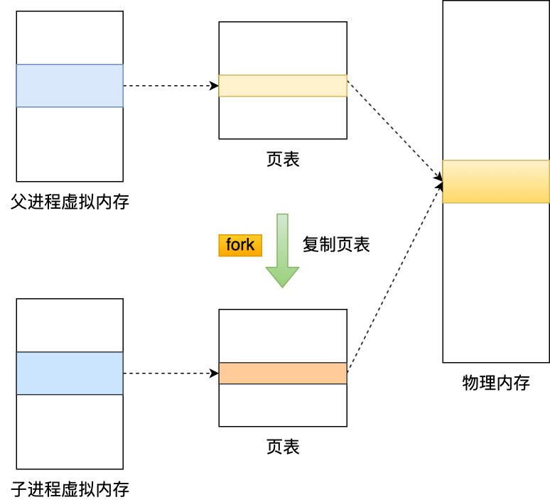

这样一来，子进程就共享了父进程的物理内存数据了，这样能够**节约物理内存资源**，页表对应的页表项的属性会标记该物理内存的权限为**只读**。

不过，当父进程或者子进程在向这个内存发起写操作时，CPU 就会触发**缺页中断**，这个缺页中断是由于违反权限导致的，然后操作系统会在「缺页异常处理函数」里进行**物理内存的复制**，并重新设置其内存映射关系，将父子进程的内存读写权限设置为**可读写**，最后才会对内存进行写操作，这个过程被称为「**写时复制(Copy On Write)**」

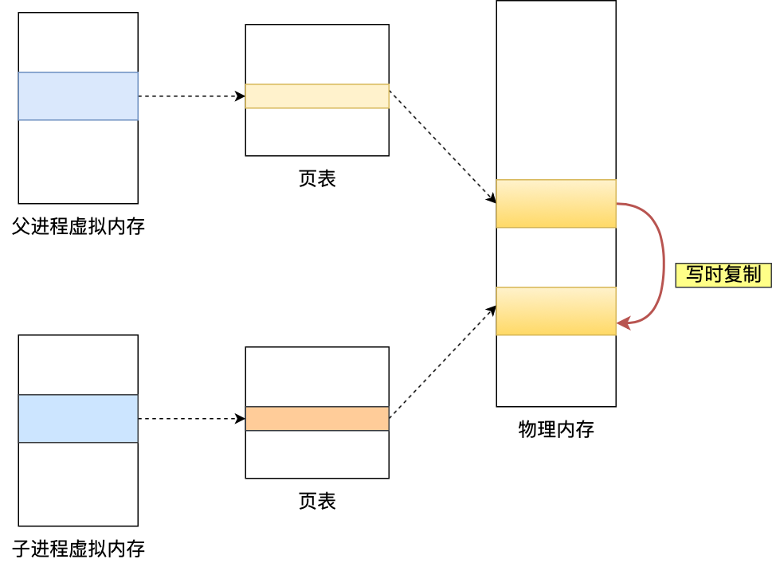

**在发生写操作的时候，操作系统才会去复制物理内存**，这样是为了防止 fork 创建子进程时，由于**物理内存数据的复制时间过长而导致父进程长时间阻塞**的问题。

当然，操作系统复制父进程页表的时候，父进程也是阻塞中的，不过页表的大小相比实际的物理内存小很多，所以通常复制页表的过程是比较快的。

所以，有两个阶段会导致阻塞父进程：

- 创建子进程的途中，由于要复制父进程的页表等数据结构，阻塞的时间跟页表的大小有关，页表越大，阻塞的时间也越长；
- 创建完子进程后，如果子进程或者父进程修改了共享数据，就会发生写时复制，这期间会拷贝物理内存，如果内存越大，自然阻塞的时间也越长；

触发重写机制后，主进程就会创建重写 AOF 的子进程，此时父子进程共享物理内存，**重写子进程只会对这个内存进行只读**，读取数据库里的所有数据，并逐一把内存数据的键值对转换成一条命令，再将命令记录到重写日志（新的 AOF 文件）。

如果此时**主进程修改了已经存在 key-value，就会发生写时复制，注意这里只会复制主进程修改的物理内存数据，没修改与子进程共享的物理内存**。

> 所以如果这个阶段修改的是一个 bigkey，也就是数据量比较大的 key-value 的时候，这时复制的物理内存数据的过程就会比较耗时，有阻塞主进程的风险。

所以这里就会有个问题，重写 AOF 日志过程中，如果主进程修改了已经存在的 key-value，此时该 key-value 数据在子进程的内存数据就会跟主进程的内存数据不一致。

为了解决这种数据不一致问题，Redis 设置了一个 **AOF 重写缓冲区**，这个缓冲区在创建 bgrewriteaof 子进程之后开始使用。

在重写 AOF 期间，当 Redis 执行完一个写命令之后，它会**同时将这个写命令写入到 「AOF 缓冲区」和 「AOF 重写缓冲区」**。

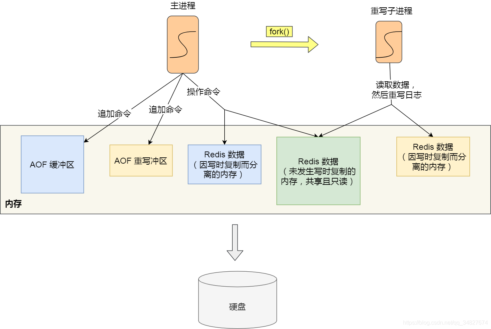

也就是说，在 bgrewriteaof 子进程执行 AOF 重写期间，主进程需要执行以下三个工作:

- 执行客户端发来的命令；
- 将执行后的写命令追加到 「AOF 缓冲区」；
- 将执行后的写命令追加到 「AOF 重写缓冲区」；

当子进程完成 AOF 重写工作（*扫描数据库中所有数据，逐一把内存数据的键值对转换成一条命令，再将命令记录到重写日志*）后，会向主进程发送一条信号，信号是进程间通讯的一种方式，且是异步的。

主进程收到该信号后，会调用一个信号处理函数，该函数主要做以下工作：

- 将AOF重写缓存中的内容全部写入到新的AOF文件中；这个时候新的AOF文件所保存的数据库状态和服务器当前的数据库状态一致；
- 对新的AOF文件进行改名，原子的覆盖原有的AOF文件；完成新旧两个AOF文件的替换。

所以在整个 AOF 后台重写过程中，除了发生写时复制会对主进程造成阻塞，还有信号处理函数执行时也会对主进程造成阻塞，在其他时候，AOF 后台重写都不会阻塞主进程。

# RDB

虽说 Redis 是内存数据库，但是它为数据的持久化提供了两个技术。分别是「 AOF 日志和 RDB 快照」。

- AOF 文件的内容是操作命令；
- RDB 文件的内容是二进制数据。

即，RDB 快照记录某一个瞬间的内存数据，记录的是实际数据，而 AOF 文件记录的是命令操作的日志，而不是实际的数据。

因此在 Redis 恢复数据时， RDB 恢复数据的效率会比 AOF 高些，因为直接将 RDB 文件读入内存就可以，不需要像 AOF 那样还需要额外执行操作命令的步骤才能恢复数据。

## 触发时机

Redis 默认提供了以下配置触发创建子进程来生成 RDB 快照文件：

```text
save 900 1
save 300 10
save 60 10000
```

- 900 秒之内，对数据库进行了至少 1 次修改；
- 300 秒之内，对数据库进行了至少 10 次修改；
- 60 秒之内，对数据库进行了至少 10000 次修改。


> Redis 的快照是**全量快照**，也就是说每次执行快照，都是把内存中的「所有数据」都记录到磁盘中。
>
> 所以可以认为，执行快照是一个比较重的操作，如果频率太频繁，可能会对 Redis 性能产生影响。如果频率太低，服务器故障时，丢失的数据会更多。
>
> 通常可能设置至少 5 分钟才保存一次快照，这时如果 Redis 出现宕机等情况，则意味着最多可能丢失 5 分钟数据。
>
> **这就是 RDB 快照的缺点，在服务器发生故障时，丢失的数据会比 AOF 持久化的方式更多，因为 RDB 快照是全量快照的方式，因此执行的频率不能太频繁，否则会影响 Redis 性能，而 AOF 日志可以以秒级的方式记录操作命令，所以丢失的数据就相对更少。**

## 具体实现

执行 bgsave 过程中，Redis 依然**可以继续处理操作命令**的，也就是数据是能被修改的。

具体实现的方式是**写时复制技术（Copy-On-Write, COW）。**

执行 bgsave 命令的时候，会通过 `fork()` 创建子进程，此时子进程和父进程是共享同一片内存数据的，因为创建子进程的时候，会复制父进程的页表，但是页表指向的物理内存还是一个。


只有在发生修改内存数据的情况时，物理内存才会被复制一份。「**写时复制(Copy On Write)**」


这样的目的是为了减少创建子进程时的性能损耗，从而加快创建子进程的速度，毕竟创建子进程的过程中，是会阻塞主线程的。

如果主线程对这些共享的内存数据也都是只读操作，那么，主线程和 bgsave 子进程相互不影响。

但是，如果主线程要**修改共享数据里的某一块数据**（比如键值对 `A`）时，就会发生写时复制，于是这块数据的**物理内存就会被复制一份（键值对 `A'`）**，然后**主线程在这个数据副本（键值对 `A'`）进行修改操作**。与此同时，**bgsave 子进程可以继续把原来的数据（键值对 `A`）写入到 RDB 文件**。


所以 bgsave 快照过程中，如果主线程修改了共享数据，发生了写时复制后，RDB 快照保存的是原本的内存数据，而**主线程刚修改的数据，是不会在这一时间写入 RDB 文件的，只能交由下一次的 bgsave 快照**。因为子线程写入到 RDB 文件的内存数据是原本的内存数据。

即如果系统恰好在 RDB 快照文件创建完毕后崩溃了，那么 Redis 将会丢失主线程在快照期间修改的数据。

极端情况下，**如果所有的共享内存都被修改，则此时的内存占用是原先的 2 倍。**

所以，针对写操作多的场景，要留意下快照过程中内存的变化，防止内存被占满了。

# RDB 和 AOF 合体

尽管 RDB 比 AOF 的数据恢复速度快，但是快照的频率不好把握：

- 如果频率太低，两次快照间一旦服务器发生宕机，就可能会比较多的数据丢失；
- 如果频率太高，频繁写入磁盘和创建子进程会带来额外的性能开销。

于是便有了混合持久化，这个方法是在 Redis 4.0 提出的。

如果想要开启混合持久化功能，可以在 Redis 配置文件将下面这个配置项设置成 yes：

```text
aof-use-rdb-preamble yes
```

混合持久化工作在 **AOF 日志重写过程**

当开启了混合持久化时，在 AOF 重写日志时，`fork` 出来的重写子进程会先将与主线程共享的内存数据以 RDB 方式写入到 AOF 文件，然后主线程处理的操作命令会被记录在重写缓冲区里，重写缓冲区里的增量命令会以 AOF 方式写入到 AOF 文件，写入完成后通知主进程将新的含有 RDB 格式和 AOF 格式的 AOF 文件替换旧的的 AOF 文件。

也就是说，使用了混合持久化，AOF 文件的**前半部分是 RDB 格式的全量数据，后半部分是 AOF 格式的增量数据**。


这样的好处在于，重启 Redis 加载数据的时候，由于前半部分是 RDB 内容，这样**加载的时候速度会很快**。

加载完 RDB 的内容后，才会加载后半部分的 AOF 内容，这里的内容是 Redis 后台子进程重写 AOF 期间，主线程处理的操作命令，可以使得**数据更少的丢失**。

# 主从复制

Redis 提供了**主从复制模式**，来避免单点故障的问题。

这个模式可以保证多台服务器的数据一致性，且主从服务器之间采用的是「读写分离」的方式。

主服务器可以进行读写操作，当发生写操作时自动将写操作同步给从服务器，而从服务器一般是只读，并接受主服务器同步过来写操作命令，然后执行这条命令。

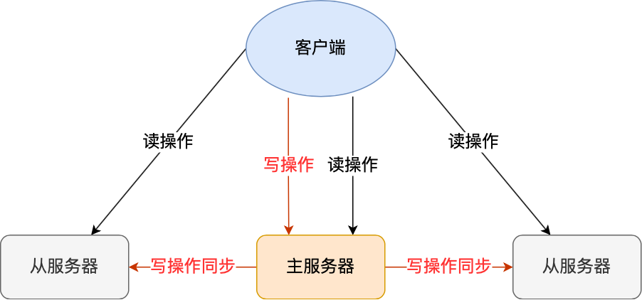

## 第一次同步

使用 `replicaof`（Redis 5.0 之前使用 slaveof）命令形成主服务器和从服务器的关系。

比如，现在有服务器 A 和 服务器 B，我们在服务器 B 上执行下面这条命令：

```text
# 服务器 B 执行这条命令
replicaof <服务器 A 的 IP 地址> <服务器 A 的 Redis 端口号>
```

接着，服务器 B 就会变成服务器 A 的「从服务器」，然后与主服务器进行第一次同步。

主从服务器间的第一次同步的过程可分为三个阶段：

- 第一阶段是建立链接、协商同步；
- 第二阶段是主服务器同步数据给从服务器；
- 第三阶段是主服务器发送新写操作命令给从服务器。

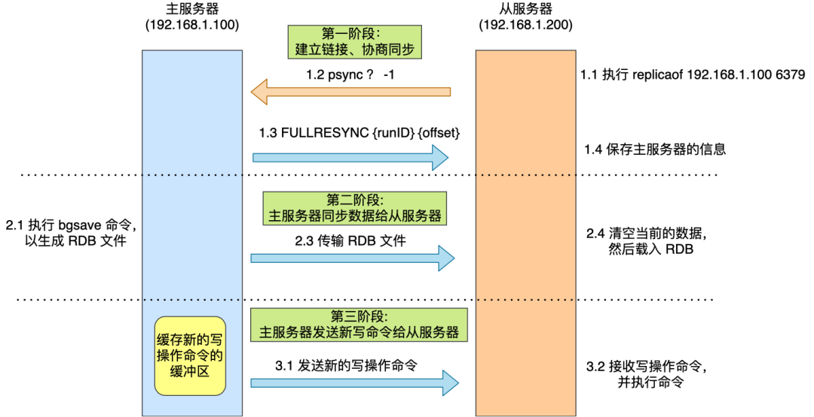

- *第一阶段：建立链接、协商同步*

  执行了 replicaof 命令后，从服务器就会给主服务器发送 `psync` 命令，表示要进行数据同步。

  psync 命令包含两个参数，分别是**主服务器的 runID** 和**复制进度 offset**。

  - runID，每个 Redis 服务器在启动时都会自动生产一个随机的 ID 来唯一标识自己。当从服务器和主服务器第一次同步时，因为不知道主服务器的 run ID，所以将其设置为 "?"。

  - offset，表示复制的进度，第一次同步时，其值为 -1。

  主服务器收到 psync 命令后，会用 `FULLRESYNC` 作为响应命令返回给对方。

  并且这个响应命令会带上两个参数：主服务器的 runID 和主服务器目前的复制进度 offset。从服务器收到响应后，会记录这两个值。

  FULLRESYNC 响应命令的意图是采用**全量复制**的方式，也就是主服务器会把所有的数据都同步给从服务器。

- *第二阶段：主服务器同步数据给从服务器*

  **主服务器会执行 bgsave 命令来生成 RDB 文件，然后把文件发送给从服务器。**

  从服务器收到 RDB 文件后，会先清空当前的数据，然后载入 RDB 文件。

  但是会有个问题，就是这期间的写操作命令并没有记录到刚刚生成的 RDB 文件中，这时主从服务器间的数据就不一致了。

  所以为了保证主从服务器的数据一致性，**主服务器会将在 RDB 文件生成后收到的写操作命令，写入到 replication buffer 缓冲区里。**

- 第三阶段：主服务器发送新写操作命令给从服务器

  **将 replication buffer 缓冲区里所记录的写操作命令发送给从服务器，然后从服务器重新执行这些操作**。

## 主从级联模式

一次全量复制中，对于主库来说，需要完成两个耗时的操作：生成 RDB 文件和传输 RDB 文件。如果从库数量很多，而且都要和主库进行全量复制的话，就会导致主库忙于 fork 子进程生成 RDB 文件，进行数据全量同步。并且传输 RDB 文件会占用主服务器的网络带宽，会对主服务器响应命令请求产生影响。

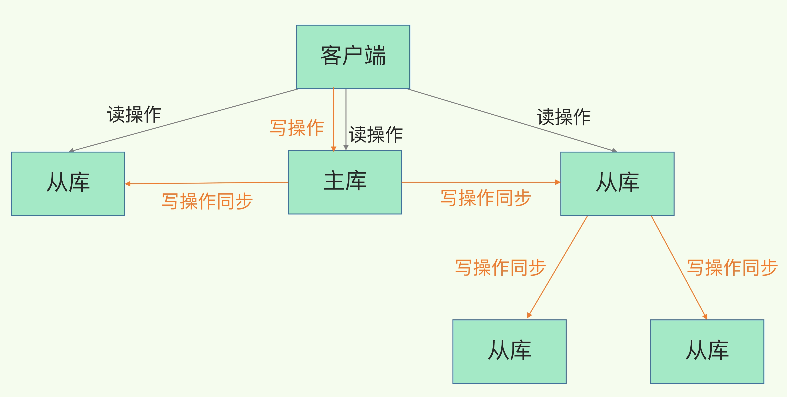

只需呀在「从服务器」上执行下面这条命令，使其作为目标服务器的从服务器：

```text
replicaof <目标服务器的IP> 6379
```

此时如果目标服务器本身也是「从服务器」，那么该目标服务器就会成为「经理」的角色，不仅可以接受主服务器同步的数据，也会把数据同步给自己旗下的从服务器，从而减轻主服务器的负担。

## 命令传播

主从服务器在完成第一次同步后，双方之间就会维护一个 TCP 连接。

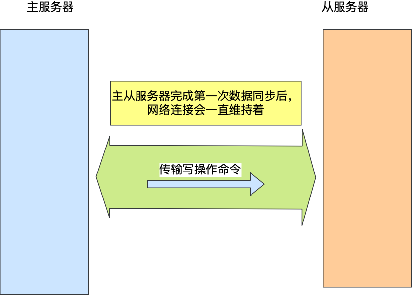

后续主服务器可以通过这个连接继续将写操作命令传播给从服务器，然后从服务器执行该命令，使得与主服务器的数据库状态相同。

而且这个连接是长连接的，目的是避免频繁的 TCP 连接和断开带来的性能开销。

上面的这个过程被称为**基于长连接的命令传播**，通过这种方式来保证第一次同步后的主从服务器的数据一致性。

## 增量同步

从 Redis 2.8 开始，网络断了之后，主从库会采用增量复制的方式继续同步。听名字大概就可以猜到它和全量复制的不同：全量复制是同步所有数据，而增量复制只会把主从库网络断连期间主库收到的命令，同步给从库。

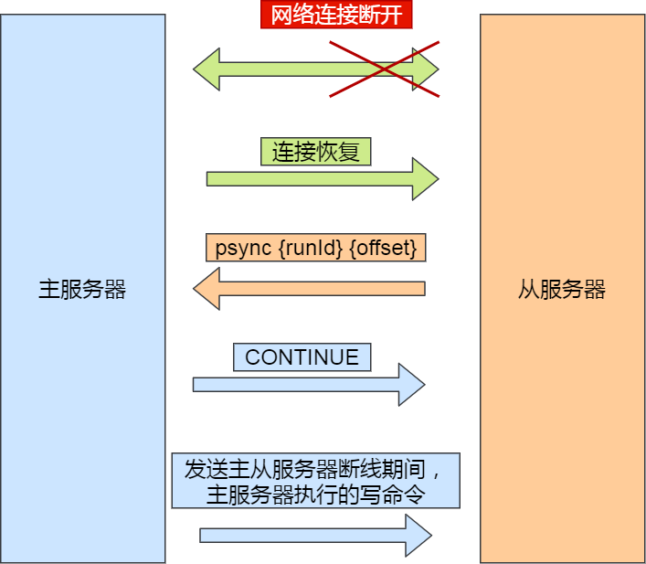

主要有三个步骤：

- 从服务器在恢复网络后，会发送 psync 命令给主服务器，此时的 psync 命令里的 offset 参数不是 -1；
- 主服务器收到该命令后，然后用 CONTINUE 响应命令告诉从服务器接下来采用增量复制的方式同步数据；
- 然后主服务将主从服务器断线期间，所执行的写命令发送给从服务器，然后从服务器执行这些命令。

那么关键的问题来了，**主服务器怎么知道要将哪些增量数据发送给从服务器呢？**

答案藏在这两个东西里：

- **repl_backlog_buffer**，是一个「**环形**」缓冲区，用于主从服务器断连后，从中找到差异的数据；
- **replication offset**，标记上面那个缓冲区的同步进度，主从服务器都有各自的偏移量，主服务器使用 master_repl_offset 来记录自己「*写*」到的位置，从服务器使用 slave_repl_offset 来记录自己「*读*」到的位置。

那repl_backlog_buffer 缓冲区是什么时候写入的呢？

在**主服务器进行命令传播时，不仅会将写命令发送给从服务器，还会将写命令写入到 repl_backlog_buffer 缓冲区里**，因此 这个缓冲区里会保存着最近传播的写命令。

网络断开后，当从服务器重新连上主服务器时，从服务器会通过 psync 命令将自己的复制偏移量 slave_repl_offset 发送给主服务器，主服务器根据自己的 master_repl_offset 和 slave_repl_offset 之间的差距，然后来决定对从服务器执行哪种同步操作：

- 如果判断出从服务器要读取的数据还在 repl_backlog_buffer 缓冲区里，那么主服务器将采用**增量同步**的方式；
- 相反，如果判断出从服务器要读取的数据已经不存在 repl_backlog_buffer 缓冲区里，那么主服务器将采用**全量同步**的方式。

当主服务器在 repl_backlog_buffer 中找到主从服务器差异（增量）的数据后，就会将增量的数据写入到**replication buffer**缓冲区，这个缓冲区我们前面也提到过，它是缓存将要传播给从服务器的命令。

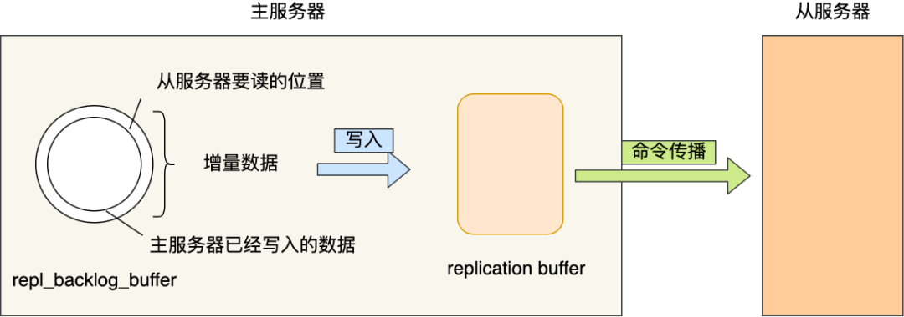

repl_backlog_buffer 缓行缓冲区的默认大小是 1M，并且由于它是一个环形缓冲区，所以当缓冲区写满后，主服务器继续写入的话，就会**覆盖之前的数据**。

因此，当主服务器的写入速度远超于从服务器的读取速度，**缓冲区的数据被覆盖，主服务器就会采用全量同步**，这个方式比增量同步的性能损耗要大很多。

因此，为了避免在网络恢复时，主服务器频繁地使用全量同步的方式，我们可以调整下 repl_backlog_buffer 缓冲区大小，尽可能的大一些，减少出现从服务器要读取的数据被覆盖的概率，从而使得主服务器采用增量同步的方式。

# 哨兵机制

- 主库真的挂了吗？
- 该选择哪个从库作为主库？
- 怎么把新主库的相关信息通知给从库和客户端呢？

在 Redis 主从集群中，哨兵机制是实现主从库自动切换的关键机制，它有效地解决了主从复制模式下故障转移的这三个问题。

**哨兵其实就是一个运行在特殊模式下的 Redis 进程**，主从库实例运行的同时，它也在运行，主要负责以下三个任务


## 监控

监控是指哨兵进程在运行时，asd周期性地给所有的主从库发送 PING 命令，检测它们是否仍然在线运行。如果从库没有在规定时间内响应哨兵的 PING 命令，哨兵就会把它标记为“下线状态”；同样，如果主库也没有在规定时间内响应哨兵的 PING 命令，哨兵就会判定主库下线，然后开始自动切换主库的流程。

**哨兵对主库的下线判断有“主观下线”和“客观下线”两种。**

- 主观下线：哨兵进程会使用 PING 命令检测它自己和主、从库的网络连接情况，用来判断实例的状态。如果哨兵发现主库或从库对 PING 命令的响应超时了，那么，哨兵就会先把它标记为“主观下线”。

> 如果检测的是从库，那么，哨兵简单地把它标记为“主观下线”就行了，因为从库的下线影响一般不太大，集群的对外服务不会间断。
>
> 但是如果检测的是主库，很有可能存在这么一个情况：那就是哨兵**误判**了，其实主库并没有故障。可是，一旦启动了主从切换，后续的选主和通知操作都会带来额外的计算和通信开销。

- 客观下线(`具体看哨兵集群小节`)：哨兵**通常会采用多实例组成的集群模式进行部署，这也被称为哨兵集群。**引入多个哨兵实例一起来判断，就可以避免单个哨兵因为自身网络状况不好，而误判主库下线的情况。同时，多个哨兵的网络同时不稳定的概率较小，由它们一起做决策，误判率也能降低。

## 选主（选择主库）


在选主时，会先判断它之前的网络连接状态。
如果从库总是和主库断连，而且断连次数超出了一定的阈值，我们就有理由相信，这个从库的网络状况并不是太好，就可以把这个从库筛掉了。

例如配置项 down-after-milliseconds * 10。

- 其中，down-after-milliseconds 是我们认定主从库断连的最大连接超时时间。如果在 down-after-milliseconds 毫秒内，主从节点都没有通过网络联系上，我们就可以认为主从节点断连了。
- 而如果发生断连的次数超过了 10 次，就说明这个从库的网络状况不好，不适合作为新主库。

接下来就要给剩余的从库打分了。我们可以分别按照三个规则依次进行三轮打分，这三个规则分别是**从库优先级、从库复制进度以及从库 ID 号**。只要在**某一轮中，有从库得分最高，那么它就是主库了，选主过程到此结束。如果没有出现得分最高的从库，那么就继续进行下一轮**。

- 第一轮：优先级最高的从库得分高。用户可以通过 slave-priority 配置项，给不同的从库设置不同优先级。在选主时，如果有一个从库优先级最高，那么它就是新主库了。如果从库的优先级都一样，那么哨兵开始第二轮打分。
- 第二轮：和旧主库同步程度最接近的从库得分高。这个规则的依据是，如果选择和旧主库同步最接近的那个从库作为主库，那么，这个新主库上就有最新的数据。在这个过程中，如果在所有从库中，有从库的 slave_repl_offset 最接近 master_repl_offset，那么它的得分就最高，可以作为新主库。
- 第三轮：ID 号小的从库得分高。

## 通知

在执行通知任务时，哨兵会把新主库的连接信息发给其他从库，让它们执行 replicaof 命令，和新主库建立连接，并进行数据复制。同时，哨兵会把新主库的连接信息通知给客户端，让它们把请求操作发到新主库上。

## 哨兵集群

> [具体看这里](https://time.geekbang.org/column/article/275337)

任何一个哨兵实例只要自身判断主库“主观下线”后，就会给其他实例发送 is-master-down-by-addr 命令。接着，其他实例会根据自己和主库的连接情况，做出 Y 或 N 的响应，Y 相当于赞成票，N 相当于反对票。


一个哨兵获得了仲裁所需的赞成票数后，就可以标记主库为“客观下线”。这个所需的赞成票数是通过哨兵配置文件中的 **quorum** 配置项设定的。

此时，这个哨兵就可以再给其他哨兵发送命令，表明希望由**自己**来执行主从切换，并让所有其他哨兵进行投票。这个投票过程称为**“Leader 选举”**。因为最终执行主从切换的哨兵称为 Leader，投票过程就是确定 Leader。

在投票过程中，任何一个想成为 Leader 的哨兵，要满足两个条件：**第一，拿到半数以上的赞成票；第二，拿到的票数同时还需要大于等于哨兵配置文件中的 quorum 值**。以 3 个哨兵为例，假设此时的 quorum 设置为 2，那么，任何一个想成为 Leader 的哨兵只要拿到 2 张赞成票，就可以了。

> 要保证所有哨兵实例的配置是一致的，尤其是主观下线的判断值 down-after-milliseconds。如果这个值在不同的哨兵实例上配置不一致，导致哨兵集群一直没有对有故障的主库形成共识，也就没有及时切换主库，最终的结果就是集群服务不稳定。

# 切片集群

- 纵向扩展：升级单个 Redis 实例的资源配置，包括增加内存容量、增加磁盘容量、使用更高配置的 CPU。就像下图中，原来的实例内存是 8GB，硬盘是 50GB，纵向扩展后，内存增加到 24GB，磁盘增加到 150GB。
- 横向扩展：横向增加当前 Redis 实例的个数，就像下图中，原来使用 1 个 8GB 内存、50GB 磁盘的实例，现在使用三个相同配置的实例。


切片集群不可避免地涉及到多个实例的分布式管理问题。

- 数据切片后，在多个实例之间如何分布
- 客户端怎么确定想要访问的数据在哪个实例上

从 3.0 开始，官方提供了一个名为 **Redis Cluster** 的方案，用于实现切片集群。

Redis Cluster 方案采用**哈希槽（Hash Slot）**，来处理数据和实例之间的映射关系。而一个切片集群共有 16384 个哈希槽，这些哈希槽类似于数据分区，每个键值对都会根据它的 key，被映射到一个哈希槽中。

具体映射过程分为两大步

- 首先根据键值对的 key，按照CRC16 算法计算一个 16 bit 的值；
- 然后，再用这个 16bit 值对 16384 取模，得到 0~16383 范围内的模数，每个模数代表一个相应编号的哈希槽。

## slot 映射到 redis 实例

- 可以使用 cluster create 命令创建集群。此时，Redis 会自动把这些槽**平均分布**在集群实例上。例如，如果集群中有 N 个实例，那么，每个实例上的槽个数为 16384/N 个。

- 也可以使用 cluster meet 命令手动建立实例间的连接，形成集群，再使用 cluster addslots 命令，指定每个实例上的哈希槽个数。

  > 在手动分配哈希槽时，需要把 16384 个槽都分配完，否则 Redis 集群无法正常工作。

## 客户端如何定位数据？

> [具体看这里](https://time.geekbang.org/column/article/276545)

客户端和集群实例建立连接后，实例就会把哈希槽的分配信息发给客户端。

客户端收到哈希槽信息后，会**把哈希槽信息缓存在本地。当客户端请求键值对时，会先计算键所对应的哈希槽，然后就可以给相应的实例发送请求了。**

但是在集群中，实例和哈希槽的对应关系并不是一成不变的，最常见的变化有两个：

- 在集群中，实例有新增或删除，Redis 需要重新分配哈希槽；
- 为了负载均衡，Redis 需要把哈希槽在所有实例上重新分布一遍。

客户端发送请求时，会收到命令执行报错信息。重定向机制 MOVED 和 ASK 命令

# 主从方式、哨兵集群、 切片集群

- 主从方式（主要为了 高可用 和 分担读 的压力，每个节点数据是一致的） 
- 哨兵集群（非主从，单纯集群） 
- 切片集群（降低节点的压力和单节点内存大小，每个节点的数据是不一致的，分布式的，共同承担整个redis集群查询操作；切片集群有slot哈希槽的概念，类似于数据分区，哈希槽有16384个，不同的哈希槽绑定不同的redis实例；新来请求的key会在客户端侧通过CRC16计算再对16384取模得到哈希槽编号，查本地缓存找到对应的实例地址和端口进行下一步查询；如果Redis实例扩容等操作引起哈希槽分配变换，实例通过返回重定向 MOVED 或者 ASK（当前还未迁移结束），让客户端去请求槽所在的新实例）

# 缓存雪崩

>  定义：当**大量缓存数据在同一时间过期（失效）或者 Redis 故障宕机**时，如果此时有大量的用户请求，都无法在 Redis 中处理，于是全部请求都直接访问数据库，从而导致数据库的压力骤增，严重的会造成数据库宕机，从而形成一系列连锁反应，造成整个系统崩溃。

可以看到，发生缓存雪崩有两个原因：

- 大量数据同时过期；(大量请求打到数据库)
- Redis 故障宕机；(大量请求打到数据库)

常见的应对方法有下面这几种：

1. 均匀设置过期时间：如果要给缓存数据设置过期时间，应该避免将大量的数据设置成同一个过期时间。我们可以在对缓存数据设置过期时间时，**给这些数据的过期时间加上一个随机数**，这样就保证数据不会在同一时间过期。

2. 互斥锁：当业务线程在处理用户请求时，**如果发现访问的数据不在 Redis 里，就加个互斥锁，保证同一时间内只有一个请求来构建缓存**，当缓存构建完成后，再释放锁。未能获取互斥锁的请求，要么等待锁释放后重新读取缓存，要么就返回空值或者默认值。

   引发问题：实现互斥锁的时候，最好设置**超时时间**，不然第一个请求拿到了锁，然后这个请求发生了某种意外而一直阻塞，一直不释放锁，这时其他请求也一直拿不到锁，整个系统就会出现无响应的现象。

3. 双 key 策略：我们对缓存数据可以使用两个 key，一个是**主 key，会设置过期时间**，一个是**备 key，不会设置过期**，它们只是 key 不一样，但是 value 值是一样的，相当于给缓存数据做了个副本。

   当业务线程访问不到「主 key 」的缓存数据时，就直接返回「备 key 」的缓存数据，然后在更新缓存的时候，**同时更新「主 key 」和「备 key 」的数据。**

4. 后台更新缓存：业务线程不再负责更新缓存，缓存也不设置有效期，而是**让缓存“永久有效”，并将更新缓存的工作交由后台线程定时更新**。

   - 第一种方式，后台线程不仅负责定时更新缓存，而且也负责**频繁地检测缓存是否有效**，检测到缓存失效了，原因可能是系统紧张而被淘汰的，于是就要马上从数据库读取数据，并更新到缓存。

     这种方式的检测时间间隔不能太长，太长也导致用户获取的数据不是有效的，所以检测的间隔最好是毫秒级的，但是总归是有个间隔时间，用户体验一般。

   - 第二种方式，在业务线程发现缓存数据失效后（缓存数据被淘汰），**通过消息队列发送一条消息通知后台线程更新缓存**，后台线程收到消息后，在更新缓存前可以判断缓存是否存在，存在就不执行更新缓存操作；不存在就读取数据库数据，并将数据加载到缓存。这种方式相比第一种方式缓存的更新会更及时，用户体验也比较好。

     在业务刚上线的时候，我们最好提前把数据缓起来，而不是等待用户访问才来触发缓存构建，这就是所谓的**缓存预热**，后台更新缓存的机制刚好也适合干这个事情。

5. 服务熔断（**暂停业务应用对缓存服务的访问，直接返回错误**）或请求限流机制（**只将少部分请求发送到数据库进行处理，再多的请求就在入口直接拒绝服务**）；
6. 构建 Redis 缓存高可靠集群（**主从节点**）；

# 缓存穿透

> 定义：当用户访问的数据，**既不在缓存中，也不在数据库中**，导致请求在访问缓存时，发现缓存缺失，再去访问数据库时，发现数据库中也没有要访问的数据，没办法构建缓存数据，来服务后续的请求。那么当有大量这样的请求到来时，数据库的压力骤增，这就是**缓存穿透**的问题。

缓存穿透的发生一般有这两种情况：

- 业务误操作，缓存中的数据和数据库中的数据都被误删除了，所以导致缓存和数据库中都没有数据；
- 黑客恶意攻击，故意大量访问某些读取不存在数据的业务；

应对缓存穿透的方案，常见的方案有三种。

- 第一种方案，非法请求的限制；
- 第二种方案，缓存空值或者默认值；
- 第三种方案，使用布隆过滤器快速判断数据是否存在，避免通过查询数据库来判断数据是否存在；

# 缓存击穿

> 定义：如果缓存中的**某个热点数据过期**了，此时大量的请求访问了该热点数据，就无法从缓存中读取，直接访问数据库，数据库很容易就被高并发的请求冲垮，这就是**缓存击穿**的问题。

应对缓存击穿可以采取前面说到两种方案：

- 互斥锁方案，保证同一时间只有一个业务线程更新缓存，未能获取互斥锁的请求，要么等待锁释放后重新读取缓存，要么就返回空值或者默认值。
- 不给热点数据设置过期时间，由后台异步更新缓存，或者在热点数据准备要过期前，提前通知后台线程更新缓存以及重新设置过期时间；


# Redis 是如何判断数据是否过期的呢？

Redis 通过一个叫做过期字典（可以看作是 hash 表）来保存数据过期的时间。过期字典的键指向 Redis 数据库中的某个 key(键)，过期字典的值是一个 long long 类型的整数，这个整数保存了 key 所指向的数据库键的过期时间（毫秒精度的 UNIX 时间戳）


```c
typedef struct redisDb {
    ...

    dict *dict;     //数据库键空间,保存着数据库中所有键值对
    dict *expires   // 过期字典,保存着键的过期时间
    ...
} redisDb;
```

# redis过期数据删除策略

Redis 采用的是 **定期删除+惰性/懒汉式删除** 

1. **惰性删除** ：只会在取出 key 的时候才对数据进行过期检查。这样对 CPU 最友好，但是可能会造成太多过期 key 没有被删除。
2. **定期删除** ： 每隔一段时间抽取一批 key 执行删除过期 key 操作。并且，Redis 底层会通过限制删除操作执行的时长和频率来减少删除操作对 CPU 时间的影响。**(这里不是执行数据淘汰策略，数据淘汰策略只有在内存到达设定值时触发)**

# redis 数据淘汰策略

设定缓存最大容量

```config
CONFIG SET maxmemory 4gb
```


1. **volatile-lru（least recently used）**：从已设置过期时间的数据集（server.db[i].expires）中挑选最近最少使用的数据淘汰

2. **volatile-ttl**：从已设置过期时间的数据集（server.db[i].expires）中挑选将要过期的数据淘汰

3. **volatile-random**：从已设置过期时间的数据集（server.db[i].expires）中任意选择数据淘汰

4. **allkeys-lru（least recently used）**：当内存不足以容纳新写入数据时，在键空间中，移除最近最少使用的 key（这个是最常用的）

5. **allkeys-random**：从数据集（server.db[i].dict）中任意选择数据淘汰

6. **volatile-lfu（least frequently used）**：从已设置过期时间的数据集（server.db[i].expires）中挑选最不经常使用的数据淘汰

7. **allkeys-lfu（least frequently used）**：当内存不足以容纳新写入数据时，在键空间中，移除最不经常使用的 key

8. **no-eviction**：禁止驱逐数据，也就是说当内存不足以容纳新写入数据时，新写入操作会报错。

   > 在redis3.0之前，默认是volatile-lru；在redis3.0之后（包括3.0），默认淘汰策略则是noeviction。

建议

- 优先使用 allkeys-lru 策略。这样，可以充分利用 LRU 这一经典缓存算法的优势，把最近最常访问的数据留在缓存中，提升应用的访问性能。如果你的业务数据中有明显的冷热数据区分，我建议你使用 allkeys-lru 策略。
- 如果业务应用中的数据访问频率相差不大，没有明显的冷热数据区分，建议使用 allkeys-random 策略，随机选择淘汰的数据就行。
- 如果你的业务中有置顶的需求，比如置顶新闻、置顶视频，那么，可以使用 volatile-lru 策略，同时不给这些置顶数据设置过期时间。这样一来，这些需要置顶的数据一直不会被删除，而其他数据会在过期时根据 LRU 规则进行筛选。

# 缓存一致性

> [缓存和数据库一致性问题](https://mp.weixin.qq.com/s/4hP-T0h8QPyjcpH8m0cbsA)
>
> [缓存和数据库一致性问题](https://mp.weixin.qq.com/s?__biz=MzIyOTYxNDI5OA==&mid=2247487312&idx=1&sn=fa19566f5729d6598155b5c676eee62d&chksm=e8beb8e5dfc931f3e35655da9da0b61c79f2843101c130cf38996446975014f958a6481aacf1&scene=178&cur_album_id=1699766580538032128#rd)

## 先更新数据库，后删除缓存

2 个线程并发「读写」数据：

1. 缓存中 X 不存在（数据库 X = 1）
2. 线程 A 读取数据库，得到旧值（X = 1）
3. 线程 B 更新数据库（X = 2)
4. 线程 B 删除缓存
5. 线程 A 将旧值写入缓存（X = 1）

最终 X 的值在缓存中是 1（旧值），在数据库中是 2（新值），也发生不一致。

**概率「很低」**，这是因为它必须满足 3 个条件：

1. 缓存刚好已失效
2. 读请求 + 写请求并发
3. 更新数据库 + 删除缓存的时间（步骤 3-4），要比读数据库 + 写缓存时间短（步骤 2 和 5）

这么来看，「先更新数据库 + 再删除缓存」的方案，很大概率是可以保证数据一致性的。

所以，我们应该采用这种方案，来操作数据库和缓存。

好，解决了并发问题，我们继续来看遗留的，**第二步执行「失败」导致数据不一致的问题**。

### 重试/补偿

无论是先操作缓存，还是先操作数据库，但凡后者执行失败了，我们就可以发起重试，尽可能地去做「补偿」。

失败后立即重试的问题在于：

- 立即重试很大概率「还会失败」
- 「重试次数」设置多少才合理？
- 重试会一直「占用」这个线程资源，无法服务其它客户端请求
- 如果在执行失败的线程中一直重试，还没等执行成功，此时如果项目「重启」了，那这次重试请求也就「丢失」了，那这条数据就一直不一致了。

更好的方案 ：**异步重试**。

其实就是把重试请求写到「消息队列」中，然后由专门的消费者来重试，直到成功。

或者更直接的做法，为了避免第二步执行失败，我们可以把操作缓存这一步，直接放到消息队列中，由消费者来操作缓存。

- **消息队列保证可靠性**：写到队列中的消息，成功消费之前不会丢失（重启项目也不担心）
- **消息队列保证消息成功投递**：下游从队列拉取消息，成功消费后才会删除消息，否则还会继续投递消息给消费者（符合我们重试的场景）

- **写队列失败**：操作缓存和写消息队列，「同时失败」的概率其实是很小的
- 消费多次失败可以加入死信队列


除了消息队列重试，另一种做法是**订阅数据库变更日志（binlog）**，再操作缓存。

具体来讲就是，我们的业务应用在修改数据时，「只需」修改数据库，无需操作缓存。该方案对业务没有任何侵入性

拿 MySQL 举例，当一条数据发生修改时，MySQL 就会产生一条变更日志（Binlog），我们可以订阅这个日志，拿到具体操作的数据，然后再根据这条数据，去删除对应的缓存。


**订阅变更日志**，目前也有了比较成熟的开源中间件，例如阿里的 canal，使用这种方案的优点在于：

- **无需考虑写消息队列失败情况**：只要写 MySQL 成功，Binlog 肯定会有
- **自动投递到下游队列**：canal 自动把数据库变更日志「投递」给下游的消息队列

当然，与此同时，我们需要投入精力去维护 canal 的高可用和稳定性。

> 如果你有留意观察很多数据库的特性，就会发现其实很多数据库都逐渐开始提供「订阅变更日志」的功能了，相信不远的将来，我们就不用通过中间件来拉取日志，自己写程序就可以订阅变更日志了，这样可以进一步简化流程。

即可以采用「先更新数据库，再删除缓存」方案，并配合「消息队列」或「订阅变更日志」的方式来做重试/补偿。

### 主从库延迟和延迟双删问题

**第一个问题**，「先删除缓存，再更新数据库」方案

2 个线程要并发「读写」数据，可能会发生以下场景：

1. 线程 A 要更新 X = 2（原值 X = 1）
2. 线程 A 先删除缓存
3. 线程 B 读缓存，发现不存在，从数据库中读取到旧值（X = 1）
4. 线程 A 将新值写入数据库（X = 2）
5. 线程 B 将旧值写入缓存（X = 1）

最终 X 的值在缓存中是 1（旧值），在数据库中是 2（新值），发生不一致。

**第二个问题**：是关于「读写分离 + 主从复制延迟」情况下，缓存和数据库一致性的问题。

在「先更新数据库，再删除缓存」方案下，「读写分离 + 主从库延迟」其实也会导致不一致：

1. 线程 A 更新主库 X = 2（原值 X = 1）
2. 线程 A 删除缓存
3. 线程 B 查询缓存，没有命中，查询「从库」得到旧值（从库 X = 1）
4. 从库「同步」完成（主从库 X = 2）
5. 线程 B 将「旧值」写入缓存（X = 1）

最终 X 的值在缓存中是 1（旧值），在主从库中是 2（新值），也发生不一致。

这 2 个问题的核心在于：**缓存都被回种了「旧值」**。

解决这类问题比较有效的办法就是，**缓存延迟双删策略**。

按照延时双删策略，这 2 个问题的解决方案是这样的：

 生成一条「延时消息」，写到消息队列中，消费者延时「删除」缓存。

这两个方案的目的，都是为了把缓存清掉，这样一来，下次就可以从数据库读取到最新值，写入缓存。

但问题来了，这个「延迟删除」缓存，延迟时间到底设置要多久呢？

- 问题1：延迟时间要大于「主从复制」的延迟时间
- 问题2：延迟时间要大于线程 B 读取数据库 + 写入缓存的时间

但是，这个时间在分布式和高并发场景下，其实是很难评估的。

很多时候，我们都是凭借经验大致估算这个延迟时间，例如延迟 1-5s，只能尽可能地降低不一致的概率。

引入缓存的目的是性能。性能和一致性不能同时满足。


CARD 借书卡：          CNO 卡号，NAME 姓名，CLASS 班级

BOOKS 图书：           BNO 书号，BNAME 书名,AUTHOR 作者，PRICE 单价，QUANTITY 库存册数

BORROW 借书记录：  CNO 借书卡号，BNO 书号，RDATE 还书日期1、找出借书超过5本的读者,输出借书卡号及所借图书册数


select CARD.CNO, count(CARD.CNO) from BORROW  

group by CARD.CNO having count(CARD.CNO) > 5
